# Week 1 - Foundations of Convolutional Neural Networks
## Computer Vision Problems
* Image Classification
* Object Detection - Car in image, put bounding box aroung it
* Neural style transfer

Note: Images of high dimensionality, means lots of parameters, so not feasible to train standard fully connected networks.

## Convolution Operation
* Image -> *shape 6 x 6*
* Kernel/Filter -> *shape 3 x 3*
* Move kernel over the 3 x 3 segments of image (left to right, top to bottom), elementwise multiply and add.
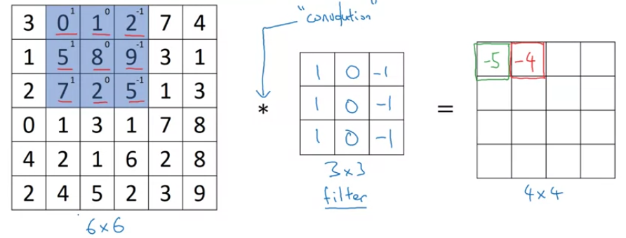

**Note**: In the fig, kernel is an vertical image detector

**Note**: conv_forward, tf.nn.conv2d in tensorflow

### Vertical Edge Detection
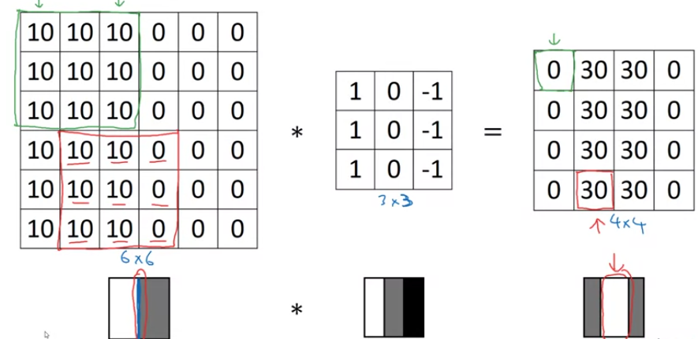

**Note**: This is a lighter to darker edge filter, darker to lighter edge filter can be made using the same way. The output values will just be the opposite to values in this case.

### Variety of edge filters
* Computer Vision experts can set hand designed filters, *sobel filter or scharr filter*
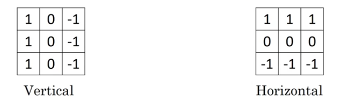
* Nowadays, it is better to learn the filters autoamtically, so filter values are actually weights of the models which are learned using backpropagation.

## Padding
* Notation:
  * Input size -> n x n
  * Kernal Size -> f x f
* Convolution operation with filter size greater than 1 reduces the size of the input image. So deeper layers of the network will have reduced size of the image.
  * Output size -> n-f+1 x n-f+1
* The pixels on the boundaries are used much lesser in the output computation as compared to the pixels in the centre.

* Solution - Padding, pad p number of pixels to each side of the image.
  * Output size -> n+2p-f+1 x n+2p-f+1

### Types
* Valid -> no padding, valid means allow only valid convolutions
* Same -> Pad so that output size is same as input
  * p = (f-1)/2

**Note**: Mostly, filter size is usually an odd number. If f is even, then we will need assymetric padding. Also, odd numbers have a central pixel

## Strided Convolution
* Move the convolution filter with *s* number of steps at a time. Both in horizontal and vertical directions.
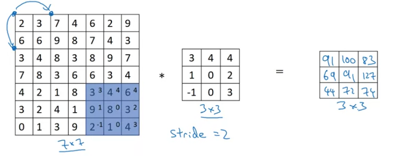
* If Stride s:
  * Output size -> floor((n+2p-f)/2)+1 x floor((n+2p-f)/2)+1
  * Taking floor value means if there is no space to perform convolution after taking the stride i.e. some kernal is not overlapping with the image, we drop that convolution
  
**Note**: 
* In math literature, convolution involves
  * Flipping the filter matrix
  * elementwise multiply and add
* Here, we are skipping the flip operation. Doing elementwise multiply and add without is called cross-correlation operation.
* In DL community, convolving without flipping is the standard convolution.
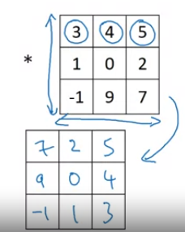

## Convolution over Volumes
### Convolution over RGB images
* Size of input -> n x n x c => c is the number of channels
* Similarly kernal -> f x f x c. Channels in input and kernel are equal.
* Move over the image, in f x f x c cubes, then elementwise multiply and add all, over channels also.
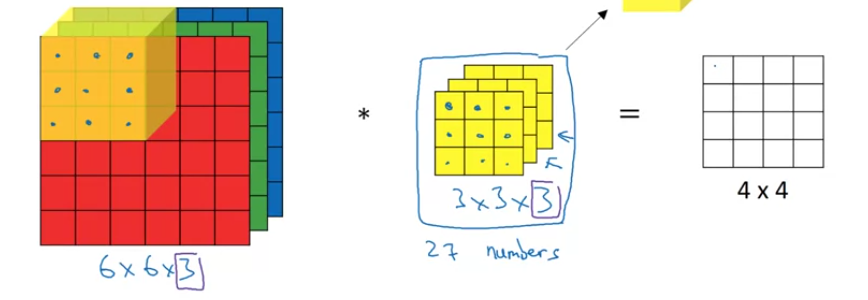

### Multiple filters
* Instead of having a single filter, we can have multiple filters.
* Each can detect different things like vertical edges, horizontal edges, inclined edges etc.
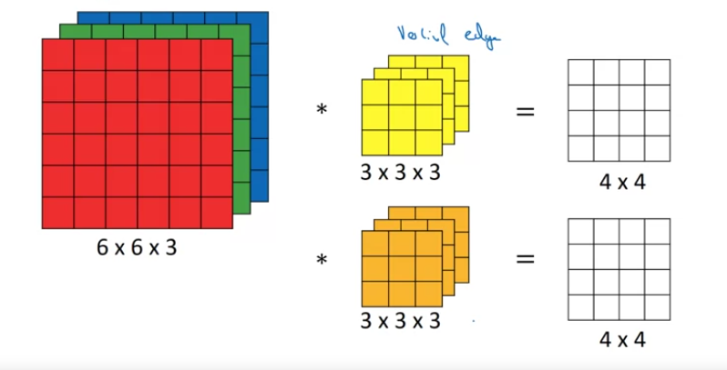
* If number of output filters are t, then output will have separate outputs for separate filters. Stack tehm and they will become the number of channels for the next layer.

**Note**: Channels are also called depth

## One layer of Convolutional Network
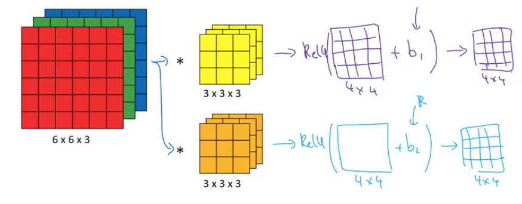
* For a layer l, a convolutional layer
  | Item | Notation |
  | :-: | :-: |
  | Filter size | `f[l]` |
  | Padding | `p[l]` |
  | Stride | `s[l]` |
  | Number of filters | `nc[l]` |
* Shapes:
  | Item | Shape |
  | :-: | :-: |
  | Filter | `f[l] x f[l] x nc[l-1]` |
  | Activations `a[l]` | `nh[l] x nw[l] x nc[l]` |
  | Weights `w[l]` | `f[l] x f[l] x nc[l-1] x nc[l]` |
  | Bias | `nc[l] -> 1 x 1 x 1 x nc[l]` |
  | Input | `nh[l-1] x nw[l-1] x nc[l-1]` |
  | Output | `nh[l] x nw[l] x nc[l]` |

**Note**: `n_[l] = floor((n_[l-1] + 2p[l] - f[l]/s[l])) + 1`

## A simple convolutional Neural Network
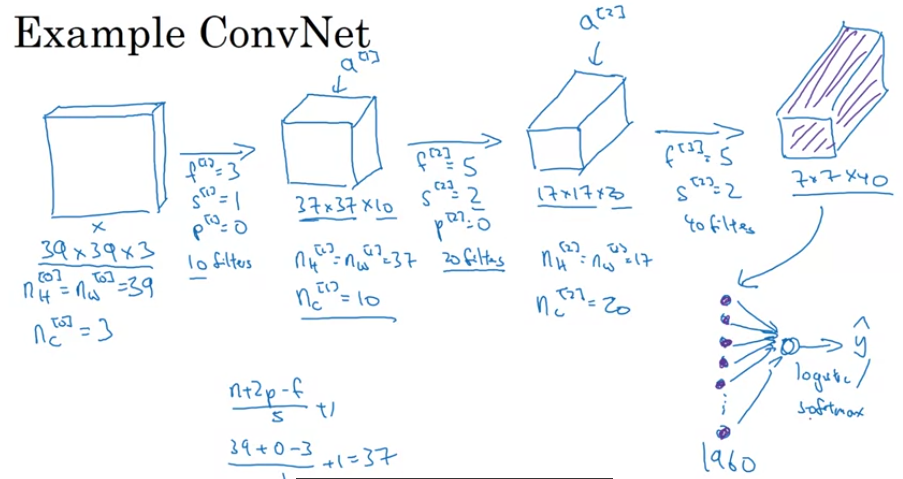

Example ConvNet:
| Layer | 0 | 1 | 2 | 3 | 4 | 5 | 6 |
| :-: | :-: | :-: | :-: | :-: | :-: | :-: | :-: | 
| Type |  Input |  Conv | Conv | Conv | Flatten |  FC | Softmax |
| nh |  39 |  37 | 17 | 7 | - | 1960 | 2 | 
| nw |  39 |  37 | 17 | 7 | - | - | - |
| nc |  3 |  10 | 20 | 40 | - | - | - |
| s |  - | 1 | 2 | 2 | - | - | - |
| p |  - | 0 | 0 | 0 | - | - | - |
| f | - | 3 | 5 | 40 | - | - | - |

## Pooling Layer
* Keep the bigger/smaller value of all the values in the filter.
* Intuition - If a particular feature exists in a filter, then that value should be, sort of, highlighted in the output.
* Pooling layer has hyper parameters - filter size and stride - no parameters to learn. **f=2, s=2** generally used.
* Pooling layer is applied on each channel separately. So number of channels remains same. So Input -> nh1 x nw1 x nc1; Output -> nh2 x nw2 x nc1.
* Max Pooling - 
  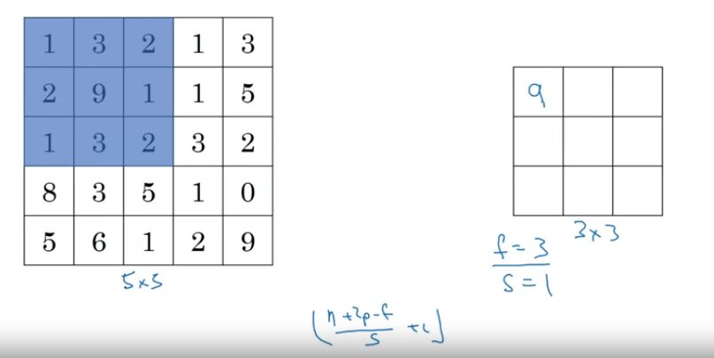
* Average Pooling -
  * Instead of taking max of the values, take average of the values
  * Not used often.

## CNN Example
* LeNet-5 for Digit Recognition (Conv, Pool, FCN, Softmax)
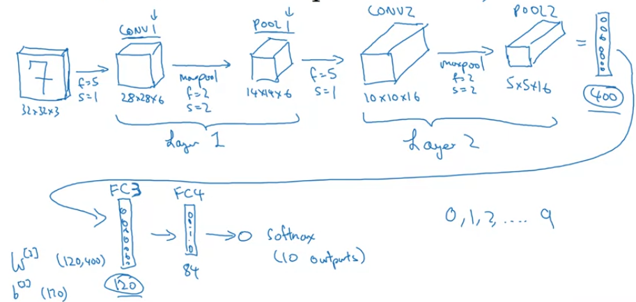
* Two conventions -  Conv and Maxpool combined as layer, and conv and pool as separate layers. Usually, they both combined are treated as 1 layer as pool layer has no parameters to learn.

| Layer | 0 | 1 | 1 | 2 | 2 | 3 | 4 | 5 | 6 | 
| :-: | :-: | :-: | :-: | :-: | :-: | :-: | :-: | :-: | :-: | 
| Type |  Input | Conv | Pool | Conv | Pool | Flatten |  FC  | FC | Softmax |
| nh | 32 | 28 | 14 | 10 | 5 | 400 | 120 | 84 | 10 |  
| nw | 32 | 28 | 14 | 10 | 5 | - | - | - | - |
| nc | 3 | 8 | 8 | 16 | 16 | - | - | - | - |
| s |  - | 1 | 2 | 1 | 2 | - | - | - | - |
| p |  - | 0 | 0 | 0 | 0  |-  |  - | - | - |
| f | - | 5 | 2 | 5 | 2 | - |  - | - | - |
| Activation size | 3072 | 6272 | 1568 | 1600 | 400 | 400 | 120 | 84 | 10 |
| Parameters | - | 608 | - | 3216 | - | - | 48120 | 10164 | 850

**Note**: As we go deeper, the height and width decreases, while number of channels increase.

**Note**: Size of activation decreases gradually for better performance.

**Note**: For hyperparameters, like number of channels, filters, filter size, follow SOTA patterns.

## Why convolutions?
* **Parameter sharing** - one filter(vertical edge) can be used at multiple positions in the image to detect images
* **Sparsity of Connections** - each output value depends only on a small number of inputs. Less overfitting. Works well even if the image is translated.


Finally,
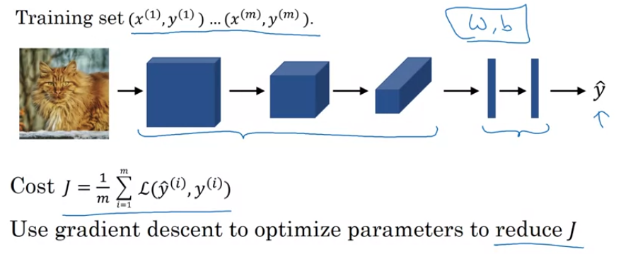

# Week 2 - Case Studies
* Can get intuition from previous work
* NN on one CV task often work well on other CV tasks

## LeNet-5 (Handwritten Digit Recognition)
* Published in 1998
* Used grayscale images
  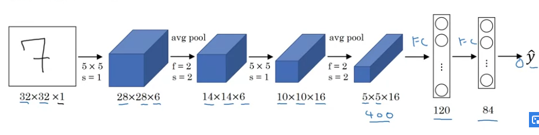
* Around 60k parameters
* From L->R, height and width decreases, num channels increases
* Original paper uses sigmoid and tanh non linearities
* Non linearity after pooling, not done in this way these days
* [Gradient-Based Learning Applied to Document Recognition - LeCun (LeNet-5)](http://yann.lecun.com/exdb/publis/pdf/lecun-01a.pdf)

## AlexNet (Image Classification)
* Named after Alex Krizhevsky
* Used RGB input
* Trained on ImageNet dataset
  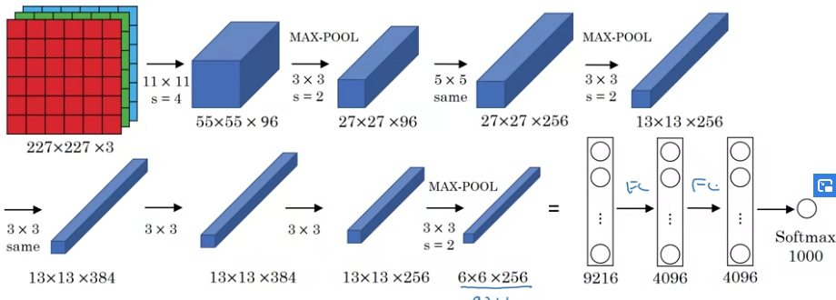
* Very similar to LeNet, but much bigger
* Around 60 million parameters
* Uses ReLU activations
* Uses Local Response Normalization - For each pixel, normalize over channels - Not used much 
* [ImageNet Classification with Deep Convolutional Neural Networks - Alex Krizhevsky (AlexNet)](https://papers.nips.cc/paper/4824-imagenet-classification-with-deep-convolutional-neural-networks.pdf)

## VGG-16
* VGG-16 -> 16 layers having weights
* Only conv and pooling layers.
* 13 Conv layers, 5 Maxpool layers, 2 FC layers, 1 Softmax
* 138 million parameters
* Conv Layer (CONV) -> 3 x 3 filter, stride 1 and  same padding
* MaxPool layer (POOL) -> 2 x 2 filter, stride 2
* Architecture
  ```python
  INPUT(224 x 224 x 3) -> CONV(64) x 2 -> 224 x 224 x 64 -> POOL -> 112 x 112 x 64 -> CONV(128) x 2 -> 112 x 112 x 128 -> POOL -> 56 x 56 x 128 -> CONV(256) x 3 -> 56 x 56 x 256 -> POOL -> 28 x 28 x 256 -> CONV(512) x 3 -> 28 x 28 x 512 -> POOL -> 14 x 14 x 512 -> CONV(512) x 3 -> 14 x 14 x 512 -> POOL -> 7 x 7 x 512 -> FLATTEN -> 25088 -> FC(4096) -> FC(4096) -> SOFTMAX(1000)
  ```
* From L->R, height and width decreases, num channels increases
* [Very Deep Convolutional Networks for Large Scale Image Recognition - Karen Simonyan, Andrew Zisserman (VGG)](https://arxiv.org/pdf/1409.1556.pdf)

## ResNets
* Deeper Networks are harder to train.
* Residual Blocks and Skip Connections
  
### Residual Block
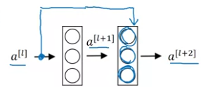
* Default forward -
  ```python
    z[l+1] = np.dot(W[l+1], a[l]) + b[l+1]
    a[l+1] = g(z[l+1])
    z[l+2] = np.dot(W[l+2], a[l+1]) + b[l+2]
    a[l+2] = g(z[l+2])
    # This is the main path
  ```
* Skip Connection (Residual Block) - 
  ```python 
    z[l+1] = np.dot(W[l+1], a[l]) + b[l+1]
    a[l+1] = g(z[l+1])
    z[l+2] = np.dot(W[l+2], a[l+1]) + b[l+2]
    a[l+2] = g(z[l+2] + a[l]) # a[l] is fed directly to l+2 layer, this is called the shortcut path or skip connection
  ```
* Helps to train deeper networks by avoiding Vanishing and Exploding Gradient problem 
* Stack multiple residual blocks to create a residual network
  | 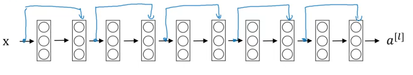 | 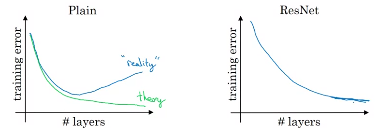 |
  | :-: | :-: |
* [Deep Residual Learning for Image Recognition - Kaiming He (Resnet)](https://arxiv.org/pdf/1512.03385.pdf)

### Why Resnets work?
* It doesnt hurt performance.
  ```python
      a[l+2] = g(z[l+2] + a[l])
      a[l+2] = g(W[l+2].a[l+1] + b[l+2] + a[l])
      # Now if due to L2 regularization, the weights becomes close to 0 or 0
      a[l+2] = g(a[l])
  ```
  **Note**: As we are adding a[l] to z[l+2], they needs to be of the same dimension, so usually **same** padding is used. Else, we can add another matrix to change dimensions.
  * So its easy the model to learn identity funtion even if we add additional residual blocks in the network. 
* Also, if the additional layers do learn something other than the identity function, it will improve performance.

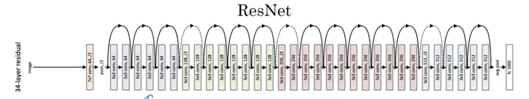

## 1 x 1 Convolution or Network in Network
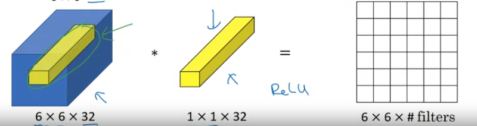
* Multiply one slice of *nC[l-1]* length with filters nC[l].
* Basically, it can convert number of filters in the previous layers to number of filters in the subsequent layer without changing the dimensions.
* Used in inception  network
* [Network in Network - Min Lin (1x1 Convolution)](https://arxiv.org/pdf/1312.4400.pdf)

## Inception Network
### Motivation - Inception Module
* Use multiple filter sizes and concatenate them together - like, 1 x 1 x 64, 3 x 3 x 128, 5 x 5 x 32, maxpool  simulataneously and concatenate.
* For kernels of different sizes, output needs to be of the same size as we need to concatenate them, so apply proper padding.
  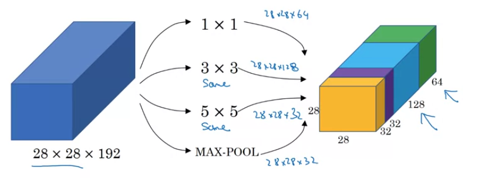
* Problem - Computational Cost - Applying 32 (5 x 5) filters on (28 x 28 x 192) input requires **120 million computations**.
* Solution - Use 1 x 1 dim convolutions to reduce 192 channels to some intermediate num channels, adn then apply 5 x 5 filter. This reduces 120 million to **12 million computations** 
  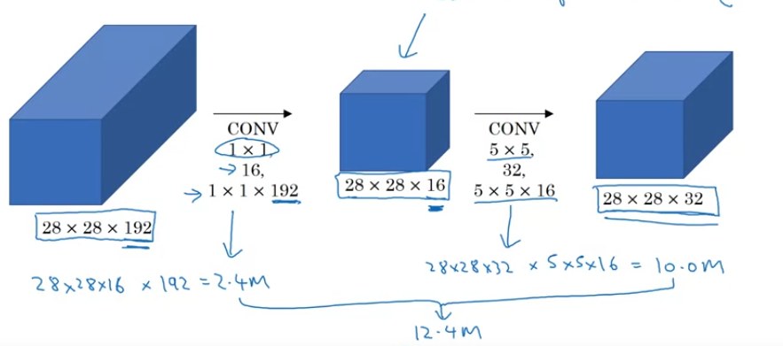
  **Note**: The layer created by 1 x 1 convolutions, is called *BottleNeck Layer*.

### Network Architecture
* **Inception block** contains multiple convolutions outputs, concatenated, wherein bigger filter sizes are implemented using 1 x 1 convolutions in between to reduce computations.
  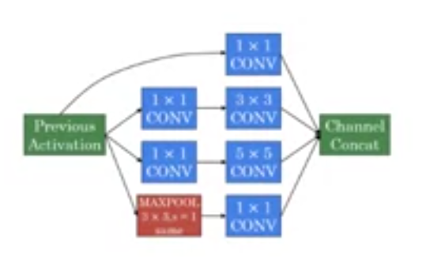
* **Inception Network** consists of stacking up inception block.
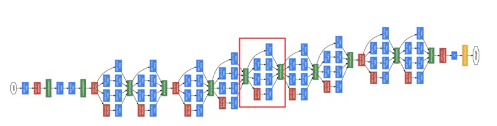
* Apart from the inception blocks, intermediate layers are branched followed by softmax to make predictions along with the last layer. Helps in regularizing the network.

* [Going Deeper with Convolutions - Christian Szegedy (Inception Net)](https://arxiv.org/pdf/1409.4842.pdf)

## Practical Advices for using ConvNets

### **Use open source implementations**
* build on top of already researched models, implementation is usually available on github.
* Implementing a research paper's model from scratch will take time, and getting the exact result si often quite difficult.
* Can also use pretrained models

### **Transfer Learning**
* Larger networks require lots of data, which is often not available.
*  Download pre-trained models and start from there instead fropm random weights
*  Use the model, remove the softmax layer, add your own softmax layer for your task, and retrain 1. either the whole network or 2. train just the last layer with the small dataset you have.
*  To reduce the computation due to the frozen layers, precompute the output of the frozen layers, and dump them to disk. They can be reused as they wont change.
* Depending on teh amount of data you have, freeze different number of layers. If more data, freeze less layers.

### **Data Augmentation**
* Can help in increasing the data size
* Common techniquies:
  * Mirroring
  * Random Cropping
  * Rotation, Shearing, Local Warping
  * Color Shifting - Add/Subtract some value to each of the RGB values to change the color of the image - Makes model more robust to color shifts **(PCA color augmentation)**
  
### **Implementing Distortion during training**
* Keep separate threads for data reading from disk followed by applying distortions and training.
  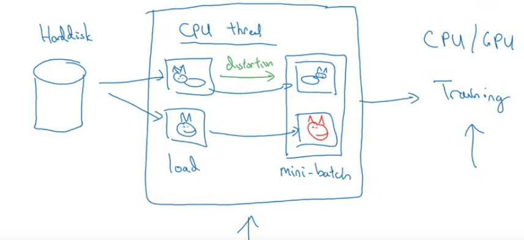
* These can run in parallel
