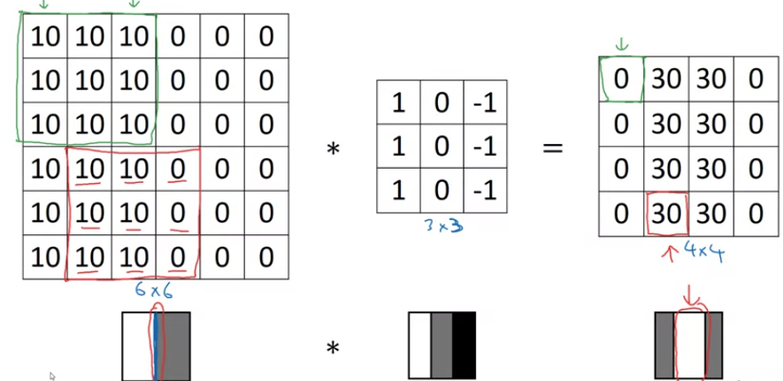
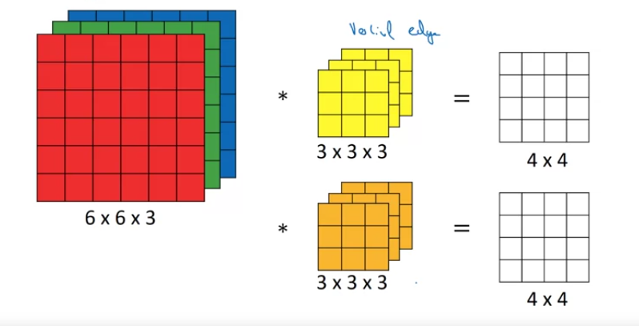
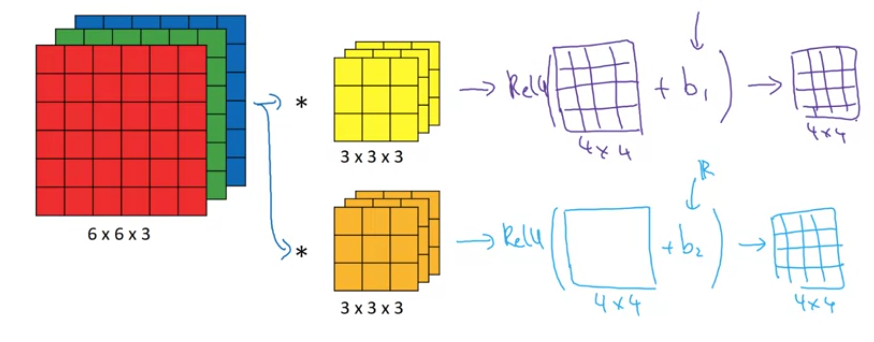

# Week 1 - Foundations of Convolutional Neural Networks
## Computer Vision Problems
* Image Classification
* Object Detection - Car in image, put bounding box aroung it
* Neural style transfer

Note: Images of high dimensionality, means lots of parameters, so not feasible to train standard fully connected networks.

## Convolution Operation
* Image -> *shape 6 x 6*
* Kernel/Filter -> *shape 3 x 3*
* Move kernel over the 3 x 3 segments of image (left to right, top to bottom), elementwise multiply and add.

**Note**: In the fig, kernel is an vertical image detector

**Note**: conv_forward, tf.nn.conv2d in tensorflow

### Vertical Edge Detection

**Note**: This is a lighter to darker edge filter, darker to lighter edge filter can be made using the same way. The output values will just be the opposite to values in this case.

### Variety of edge filters
* Computer Vision experts can set hand designed filters, *sobel filter or scharr filter*

* Nowadays, it is better to learn the filters autoamtically, so filter values are actually weights of the models which are learned using backpropagation.

## Padding
* Notation:
  * Input size -> n x n
  * Kernal Size -> f x f
* Convolution operation with filter size greater than 1 reduces the size of the input image. So deeper layers of the network will have reduced size of the image.
  * Output size -> n-f+1 x n-f+1
* The pixels on the boundaries are used much lesser in the output computation as compared to the pixels in the centre.

* Solution - Padding, pad p number of pixels to each side of the image.
  * Output size -> n+2p-f+1 x n+2p-f+1

### Types
* Valid -> no padding, valid means allow only valid convolutions
* Same -> Pad so that output size is same as input
  * p = (f-1)/2

**Note**: Mostly, filter size is usually an odd number. If f is even, then we will need assymetric padding. Also, odd numbers have a central pixel

## Strided Convolution
* Move the convolution filter with *s* number of steps at a time. Both in horizontal and vertical directions.

* If Stride s:
  * Output size -> floor((n+2p-f)/2)+1 x floor((n+2p-f)/2)+1
  * Taking floor value means if there is no space to perform convolution after taking the stride i.e. some kernal is not overlapping with the image, we drop that convolution
  
**Note**: 
* In math literature, convolution involves
  * Flipping the filter matrix
  * elementwise multiply and add
* Here, we are skipping the flip operation. Doing elementwise multiply and add without is called cross-correlation operation.
* In DL community, convolving without flipping is the standard convolution.

## Convolution over Volumes
### Convolution over RGB images
* Size of input -> n x n x c => c is the number of channels
* Similarly kernal -> f x f x c. Channels in input and kernel are equal.
* Move over the image, in f x f x c cubes, then elementwise multiply and add all, over channels also.

### Multiple filters
* Instead of having a single filter, we can have multiple filters.
* Each can detect different things like vertical edges, horizontal edges, inclined edges etc.

* If number of output filters are t, then output will have separate outputs for separate filters. Stack tehm and they will become the number of channels for the next layer.

**Note**: Channels are also called depth

## One layer of Convolutional Network

* For a layer l, a convolutional layer
  | Item | Notation |
  | :-: | :-: |
  | Filter size | `f[l]` |
  | Padding | `p[l]` |
  | Stride | `s[l]` |
  | Number of filters | `nc[l]` |
* Shapes:
  | Item | Shape |
  | :-: | :-: |
  | Filter | `f[l] x f[l] x nc[l-1]` |
  | Activations `a[l]` | `nh[l] x nw[l] x nc[l]` |
  | Weights `w[l]` | `f[l] x f[l] x nc[l-1] x nc[l]` |
  | Bias | `nc[l] -> 1 x 1 x 1 x nc[l]` |
  | Input | `nh[l-1] x nw[l-1] x nc[l-1]` |
  | Output | `nh[l] x nw[l] x nc[l]` |

**Note**: `n_[l] = floor((n_[l-1] + 2p[l] - f[l]/s[l])) + 1`

## A simple convolutional Neural Network

Example ConvNet:
| Layer | 0 | 1 | 2 | 3 | 4 | 5 | 6 |
| :-: | :-: | :-: | :-: | :-: | :-: | :-: | :-: | 
| Type |  Input |  Conv | Conv | Conv | Flatten |  FC | Softmax |
| nh |  39 |  37 | 17 | 7 | - | 1960 | 2 | 
| nw |  39 |  37 | 17 | 7 | - | - | - |
| nc |  3 |  10 | 20 | 40 | - | - | - |
| s |  - | 1 | 2 | 2 | - | - | - |
| p |  - | 0 | 0 | 0 | - | - | - |
| f | - | 3 | 5 | 40 | - | - | - |

## Pooling Layer
* Keep the bigger/smaller value of all the values in the filter.
* Intuition - If a particular feature exists in a filter, then that value should be, sort of, highlighted in the output.
* Pooling layer has hyper parameters - filter size and stride - no parameters to learn. **f=2, s=2** generally used.
* Pooling layer is applied on each channel separately. So number of channels remains same. So Input -> nh1 x nw1 x nc1; Output -> nh2 x nw2 x nc1.
* Max Pooling - 
  
* Average Pooling -
  * Instead of taking max of the values, take average of the values
  * Not used often.

## CNN Example
* LeNet-5 for Digit Recognition (Conv, Pool, FCN, Softmax)

* Two conventions -  Conv and Maxpool combined as layer, and conv and pool as separate layers. Usually, they both combined are treated as 1 layer as pool layer has no parameters to learn.

| Layer | 0 | 1 | 1 | 2 | 2 | 3 | 4 | 5 | 6 | 
| :-: | :-: | :-: | :-: | :-: | :-: | :-: | :-: | :-: | :-: | 
| Type |  Input | Conv | Pool | Conv | Pool | Flatten |  FC  | FC | Softmax |
| nh | 32 | 28 | 14 | 10 | 5 | 400 | 120 | 84 | 10 |  
| nw | 32 | 28 | 14 | 10 | 5 | - | - | - | - |
| nc | 3 | 8 | 8 | 16 | 16 | - | - | - | - |
| s |  - | 1 | 2 | 1 | 2 | - | - | - | - |
| p |  - | 0 | 0 | 0 | 0  |-  |  - | - | - |
| f | - | 5 | 2 | 5 | 2 | - |  - | - | - |
| Activation size | 3072 | 6272 | 1568 | 1600 | 400 | 400 | 120 | 84 | 10 |
| Parameters | - | 608 | - | 3216 | - | - | 48120 | 10164 | 850

**Note**: As we go deeper, the height and width decreases, while number of channels increase.

**Note**: Size of activation decreases gradually for better performance.

**Note**: For hyperparameters, like number of channels, filters, filter size, follow SOTA patterns.

## Why convolutions?
* **Parameter sharing** - one filter(vertical edge) can be used at multiple positions in the image to detect images
* **Sparsity of Connections** - each output value depends only on a small number of inputs. Less overfitting. Works well even if the image is translated.

Finally,
