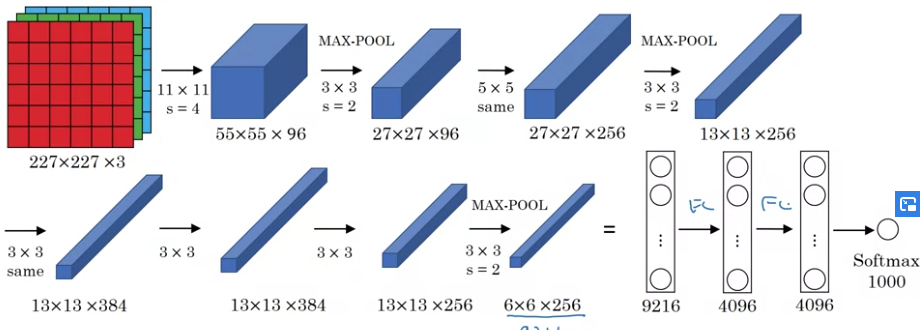
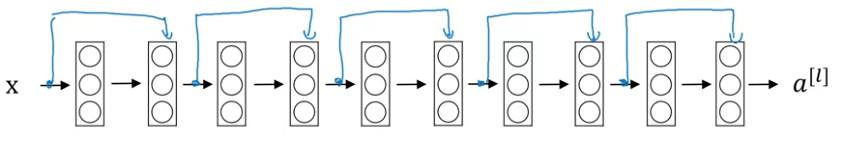
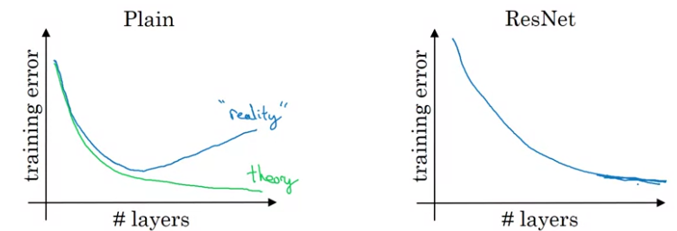
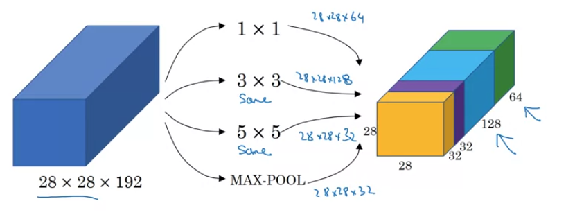
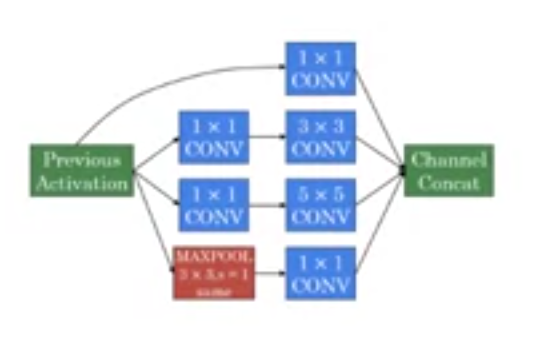
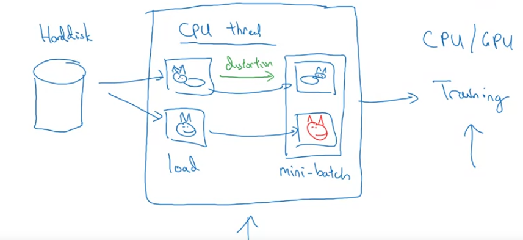

# Week 2 - Case Studies
* Can get intuition from previous work
* NN on one CV task often work well on other CV tasks

## LeNet-5 (Handwritten Digit Recognition)
* Published in 1998
* Used grayscale images
  
* Around 60k parameters
* From L->R, height and width decreases, num channels increases
* Original paper uses sigmoid and tanh non linearities
* Non linearity after pooling, not done in this way these days
* [Gradient-Based Learning Applied to Document Recognition - LeCun (LeNet-5)](http://yann.lecun.com/exdb/publis/pdf/lecun-01a.pdf)

## AlexNet (Image Classification)
* Named after Alex Krizhevsky
* Used RGB input
* Trained on ImageNet dataset
  
* Very similar to LeNet, but much bigger
* Around 60 million parameters
* Uses ReLU activations
* Uses Local Response Normalization - For each pixel, normalize over channels - Not used much 
* [ImageNet Classification with Deep Convolutional Neural Networks - Alex Krizhevsky (AlexNet)](https://papers.nips.cc/paper/4824-imagenet-classification-with-deep-convolutional-neural-networks.pdf)

## VGG-16
* VGG-16 -> 16 layers having weights
* Only conv and pooling layers.
* 13 Conv layers, 5 Maxpool layers, 2 FC layers, 1 Softmax
* 138 million parameters
* Conv Layer (CONV) -> 3 x 3 filter, stride 1 and  same padding
* MaxPool layer (POOL) -> 2 x 2 filter, stride 2
* Architecture
  ```python
  INPUT(224 x 224 x 3) -> CONV(64) x 2 -> 224 x 224 x 64 -> POOL -> 112 x 112 x 64 -> CONV(128) x 2 -> 112 x 112 x 128 -> POOL -> 56 x 56 x 128 -> CONV(256) x 3 -> 56 x 56 x 256 -> POOL -> 28 x 28 x 256 -> CONV(512) x 3 -> 28 x 28 x 512 -> POOL -> 14 x 14 x 512 -> CONV(512) x 3 -> 14 x 14 x 512 -> POOL -> 7 x 7 x 512 -> FLATTEN -> 25088 -> FC(4096) -> FC(4096) -> SOFTMAX(1000)
  ```
* From L->R, height and width decreases, num channels increases
* [Very Deep Convolutional Networks for Large Scale Image Recognition - Karen Simonyan, Andrew Zisserman (VGG)](https://arxiv.org/pdf/1409.1556.pdf)

## ResNets
* Deeper Networks are harder to train.
* Residual Blocks and Skip Connections
  
### Residual Block

* Default forward -
  ```python
    z[l+1] = np.dot(W[l+1], a[l]) + b[l+1]
    a[l+1] = g(z[l+1])
    z[l+2] = np.dot(W[l+2], a[l+1]) + b[l+2]
    a[l+2] = g(z[l+2])
    # This is the main path
  ```
* Skip Connection (Residual Block) - 
  ```python 
    z[l+1] = np.dot(W[l+1], a[l]) + b[l+1]
    a[l+1] = g(z[l+1])
    z[l+2] = np.dot(W[l+2], a[l+1]) + b[l+2]
    a[l+2] = g(z[l+2] + a[l]) # a[l] is fed directly to l+2 layer, this is called the shortcut path or skip connection
  ```
* Helps to train deeper networks by avoiding Vanishing and Exploding Gradient problem 
* Stack multiple residual blocks to create a residual network
  |  |  |
  | :-: | :-: |
* [Deep Residual Learning for Image Recognition - Kaiming He (Resnet)](https://arxiv.org/pdf/1512.03385.pdf)

### Why Resnets work?
* It doesnt hurt performance.
  ```python
      a[l+2] = g(z[l+2] + a[l])
      a[l+2] = g(W[l+2].a[l+1] + b[l+2] + a[l])
      # Now if due to L2 regularization, the weights becomes close to 0 or 0
      a[l+2] = g(a[l])
  ```
  **Note**: As we are adding a[l] to z[l+2], they needs to be of the same dimension, so usually **same** padding is used. Else, we can add another matrix to change dimensions.
  * So its easy the model to learn identity funtion even if we add additional residual blocks in the network. 
* Also, if the additional layers do learn something other than the identity function, it will improve performance.


## 1 x 1 Convolution or Network in Network

* Multiply one slice of *nC[l-1]* length with filters nC[l].
* Basically, it can convert number of filters in the previous layers to number of filters in the subsequent layer without changing the dimensions.
* Used in inception  network
* [Network in Network - Min Lin (1x1 Convolution)](https://arxiv.org/pdf/1312.4400.pdf)

## Inception Network
### Motivation - Inception Module
* Use multiple filter sizes and concatenate them together - like, 1 x 1 x 64, 3 x 3 x 128, 5 x 5 x 32, maxpool  simulataneously and concatenate.
* For kernels of different sizes, output needs to be of the same size as we need to concatenate them, so apply proper padding.
  
* Problem - Computational Cost - Applying 32 (5 x 5) filters on (28 x 28 x 192) input requires **120 million computations**.
* Solution - Use 1 x 1 dim convolutions to reduce 192 channels to some intermediate num channels, adn then apply 5 x 5 filter. This reduces 120 million to **12 million computations** 
  
  **Note**: The layer created by 1 x 1 convolutions, is called *BottleNeck Layer*.

### Network Architecture
* **Inception block** contains multiple convolutions outputs, concatenated, wherein bigger filter sizes are implemented using 1 x 1 convolutions in between to reduce computations.
  
* **Inception Network** consists of stacking up inception block.

* Apart from the inception blocks, intermediate layers are branched followed by softmax to make predictions along with the last layer. Helps in regularizing the network.

* [Going Deeper with Convolutions - Christian Szegedy (Inception Net)](https://arxiv.org/pdf/1409.4842.pdf)

## Practical Advices for using ConvNets

### **Use open source implementations**
* build on top of already researched models, implementation is usually available on github.
* Implementing a research paper's model from scratch will take time, and getting the exact result si often quite difficult.
* Can also use pretrained models

### **Transfer Learning**
* Larger networks require lots of data, which is often not available.
*  Download pre-trained models and start from there instead fropm random weights
*  Use the model, remove the softmax layer, add your own softmax layer for your task, and retrain 1. either the whole network or 2. train just the last layer with the small dataset you have.
*  To reduce the computation due to the frozen layers, precompute the output of the frozen layers, and dump them to disk. They can be reused as they wont change.
* Depending on teh amount of data you have, freeze different number of layers. If more data, freeze less layers.

### **Data Augmentation**
* Can help in increasing the data size
* Common techniquies:
  * Mirroring
  * Random Cropping
  * Rotation, Shearing, Local Warping
  * Color Shifting - Add/Subtract some value to each of the RGB values to change the color of the image - Makes model more robust to color shifts **(PCA color augmentation)**
  
### **Implementing Distortion during training**
* Keep separate threads for data reading from disk followed by applying distortions and training.
  
* These can run in parallel

# Week 3
## Object Localization (Classification with Localization)
* Apart from just classifying whether an image has an objkect or not, it has to put a bounding box around the object
  
* Object Localization - has one image to put box around
* Object Detection - can have multiple objects with different categories
  

* For classification, image is fed into ConvNet and output layer is softmax over categories.
* For localization, output layer is softmax over categories along with coordinates(the mid point, along with height and width) of the bounding box
  

### Defining Target Label y
* Need to output - bx, by, bh, bw and class label (1-4 - if there are 4 classes - one of them being background)
* y = [ <whether object in image> <bx> <by> <bh> <bw> <1 is class 1> <1 if class 2> <1 if class 3> ]
* If there is an object in the image:
  * y = [ 1 bx by bh bw 0 1 0]
* If there is no objext in the image:
  * y = [ 0 ? ? ? ? ? ? ? ] -> ? - dont care

### Loss 
* Squared loss - 
  * if y1 = 1 -> L(hat{y}, y) = (y1 - hat{y1})^2 + (y2 - hat{y2})^2 + .... + (y8 - hat{y8})^2
  * if y1 -> 0 -> L(hat{y}, y) = (y1 - hat{y1})^2 as other components are dont cares
* Complicated Loss - 
  * Log likelihood for classes (last 3 components), Squared error for bounding box coordinates, Logistic regression for component 1.

## Landmark Detection
* Can output coordinates of important points in the image - landmark points
* Eg. 4 coordinates of eyes in face recognition
* Can be used for landmark detection in face. 
  * Output - multiple components of the output can be the x and y coordinates of the various landmarks
* Can be used for emotion recognition, or AR filter
* Pose detection - Can annotate key positions on the body

## Object Detection
