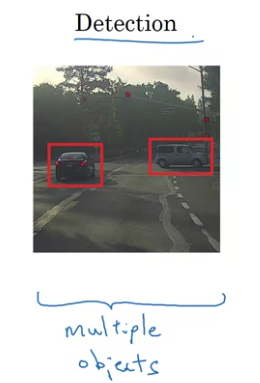

# Week 3
## Object Localization (Classification with Localization)
* Apart from just classifying whether an image has an objkect or not, it has to put a bounding box around the object
  
* Object Localization - has one image to put box around
* Object Detection - can have multiple objects with different categories
  

* For classification, image is fed into ConvNet and output layer is softmax over categories.
* For localization, output layer is softmax over categories along with coordinates(the mid point, along with height and width) of the bounding box
  

### Defining Target Label y
* Need to output - bx, by, bh, bw and class label (1-4 - if there are 4 classes - one of them being background)
* y = [ <whether object in image> <bx> <by> <bh> <bw> <1 is class 1> <1 if class 2> <1 if class 3> ]
* If there is an object in the image:
  * y = [ 1 bx by bh bw 0 1 0]
* If there is no objext in the image:
  * y = [ 0 ? ? ? ? ? ? ? ] -> ? - dont care

### Loss 
* Squared loss - 
  * if y1 = 1 -> L(hat{y}, y) = (y1 - hat{y1})^2 + (y2 - hat{y2})^2 + .... + (y8 - hat{y8})^2
  * if y1 -> 0 -> L(hat{y}, y) = (y1 - hat{y1})^2 as other components are dont cares
* Complicated Loss - 
  * Log likelihood for classes (last 3 components), Squared error for bounding box coordinates, Logistic regression for component 1.

## Landmark Detection
* Can output coordinates of important points in the image - landmark points
* Eg. 4 coordinates of eyes in face recognition
* Can be used for landmark detection in face. 
  * Output - multiple components of the output can be the x and y coordinates of the various landmarks
* Can be used for emotion recognition, or AR filter
* Pose detection - Can annotate key positions on the body

## Object Detection
