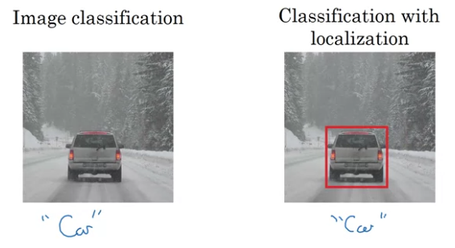

# Week 3
## Object Localization (Classification with Localization)
* Apart from just classifying whether an image has an objkect or not, it has to put a bounding box around the object
  
* Object Localization - has one image to put box around
* Object Detection - can have multiple objects with different categories
  

* For classification, image is fed into ConvNet and output layer is softmax over categories.
* For localization, output layer is softmax over categories along with coordinates(the mid point, along with height and width) of the bounding box
  

### Defining Target Label y
* Need to output - bx, by, bh, bw and class label (1-4 - if there are 4 classes - one of them being background)
* y = [ <whether object in image> <bx> <by> <bh> <bw> <1 is class 1> <1 if class 2> <1 if class 3> ]
* If there is an object in the image:
  * y = [ 1 bx by bh bw 0 1 0]
* If there is no objext in the image:
  * y = [ 0 ? ? ? ? ? ? ? ] -> ? - dont care

### Loss 
* Squared loss - 
  * if y1 = 1 -> L(hat{y}, y) = (y1 - hat{y1})^2 + (y2 - hat{y2})^2 + .... + (y8 - hat{y8})^2
  * if y1 -> 0 -> L(hat{y}, y) = (y1 - hat{y1})^2 as other components are dont cares
* Complicated Loss - 
  * Log likelihood for classes (last 3 components), Squared error for bounding box coordinates, Logistic regression for component 1.

## Landmark Detection
* Can output coordinates of important points in the image - landmark points
* Eg. 4 coordinates of eyes in face recognition
* Can be used for landmark detection in face. 
  * Output - multiple components of the output can be the x and y coordinates of the various landmarks
* Can be used for emotion recognition, or AR filter
* Pose detection - Can annotate key positions on the body

## Object Detection - 
### Car Detection Example - Sliding Windows algorithm
* Create a training set containing close cropped car images
  
* Train a ConvNet using above image as input, and a softmax over car or not as output.
* For Object Detection,
  * take the complete image, select a window size, and pass the window over the complete image (just like a filter), give that window as the input to the network.
  * Repeat for multiple window sizes.
  
* Disadvantage: Computational Cost - for a single image, multiple window crops are needed.

### Convolutional Implementation of sliding windows
* We can implement FC layers using convolutional layers.
* Can use a filter size equal to the input size, and # of filters as the needed dim of the FC layer. Mathematically, its similar to the having a FC layer.
  
  * For the first FC layer, we can use a 5 x 5 x 16 filter, whose output will be 1 x 1, we can use 400 filters to create an output of 1 x 1 x 400. 
  * Same for the next FC layer, 1 x 1 x 400 filter, and we can use 400 filters.
  
* Now, instead of inputting the multiple crops of the image and calculating whether object is present or not, we can give in the whole image in one go.

* Suppose input size for our slidong window network is 14 x 14.
* If we input a 14 x 14 input, the output will be 1 x 1. 
* If we increase the input size (16 x 16), then the output size will increase. (2 x 2).
  * Suppose we run the previous sliding window algorithm on this, we will need to crop the image, resulting in 4 images, and run them separately to get 4 outputs.
  * If we have an all convolutional network, then the final FC layers (implented using conv layers in this case), will have 4 components, each corresponding to the separate window crops.
  * Also, there are multiple overlapping computations we do in parallel using all convolutional network.
  * In this way, we can give an entire image as input to the network.
  

  | Sliding Window Sequential | Sliding Window Convolutional |
  | :-: | :-: |
  | Input will be *window* size crops of the original image  | Input will be the complete image |
  | One window at a time | All the windows simultaneously | 
  | For each crop, we will get a label, whether object is present in the image or not | We can get whether the object is in the whole image or not in parallel. Each component of the output will be similar to the output of each window position |
* [OverFeat: Integrated Recognition, Localization and Detection of Convolutional Networks - Pierre Sermanet](https://arxiv.org/pdf/1312.6229.pdf)
* **Drawback** - The output bounding box is not accurate.

### Better Bounding Box Prediction
* You Only Look Once (YOLO) algorithm
  * Divide the image into specific grid (3 x 3 or 19 x 19).
  * Apply image classification and localization to the images of the grid cell.
  
  * For each grid cell image, the components of the label y are defined as follows:
    * y = [ 0 ? ? ? ? ? ? ? ] if it is a background image
    * y = [ 1 bx by bh bw <1 if class 1> <1 if class 2> <1 if class 3> ]

    | Component | When is it set to 1? | Values for grid cell 6 | 
    | :-: | :-: | :-: |
    | y1 or pc | If there is an important object in the grid cell image i.e the centre of the object(bounding box) lies in the grid cell image | 1 |
    | y2 or bx | if y1=1, then x coordinate of the centre of the bounding box, between 0 and 1, current grid cell is (0,0) to (1,1) | 0.4 |
    | y3 or by | if y1=1, then y coordinate of the centre of the bounding box, between 0 and 1, current grid cell is (0,0) to (1,1) | 0.3 |
    | y4 or bh | if y1=1, then height of the bounding box relative to grid cell, can be greater than 1 | 0.9 |
    | y5 or bw | if y1=1, then width of the bounding box relative to grid cell, can be greater than 1 | 0.5 |
    | y6 or p1 | if y1=1, whether belonging to class 1 | 0 |
    | y7 or p2 | if y1=1, whether belonging to class 2 | 1 |
    | y8 or p3 | if y1=1, whether belonging to class 3 | 0 |
  * Final output shape **( <grid_rows>) x <grid_cols> x <y_dim>**
  * Can have a problem when there are multiple objects in a single grid cell. Can be solved when grid size is large i.e. each grid cell is small.
  * This is convolutional implementation. So efficient.
* [You Look Only Once: Unified, Real time Object Detection - Redmon (YOLO)](https://arxiv.org/pdf/1506.02640.pdf)

## Evaluating Object Detection Algorithm - Intersection over Union
* Calculate the union and intersection of predicted bounding box and the ground truth bounding box
* Calculate `IoU = (Size of intersection/Size of Union)`
  * Bounding Box is correct -> if IoU >= 0.5 (can be different than 0.5)
  
    * Red Box - Ground Truth
    * Purple Box - Prediction
    * Green Area - Union
    * Yellow Area - Intersection
  * if IoU is 1, then it is the perfect Box

## Non Max Supression
* Problem - There can be multiple detections of a single object (multiple grid cells where pc is 1).
* Suppress those grid cells which has less probability(less value of pc).
  * Get the max probability - Let's call this max.
  * Calculate IoU of max with all other grid cells. Suppress those whose IoU is large with max.
  * And repeat with the next max value 

  * If there are multiple objects in the image, carry out non max object suppression on each class separately.

## Anchor Boxes
* Above algorithm has issues when there are multiple objects in the same grid cell.
* We can define Anchor boxes - predefined shapes, like vertical rectangle ot horizontal rectangle, depending on the objects being detected.
  
* So two predictions in the same grid cell can be mapped to multiple anchor boxes.
* So from previous examples, if y was 8-dim; with 2 anchor boxes, y will be of 16 dims
  * The first 8 dims corresponding to the first anchor box.
  * The next 8 belonging to the second anchor box
  * and so on.
* We can assign anchor box based on the similarity between the objects bounding box and the anchor box.

### Anchor Box Algorithm

**Note**: While using anchor boxes, if there is only one object in the the grid cell, then the y label will have values corresponding to the the anchor box most similar to the object, for the rest of the anchor boxes, pc will be 0, and rest will be dont cares.

**Note**: Doesnt handle if you have 2 anchor boxes but have 3 objects.

**Note**: Anchor boxes help in specializing some nodes to learn specialized shapes. Like tall boxes for pedestrians, or wide boxes for cars.

**Note**: **How to choose anchor boxes?** 1. Either manually, 5-10 anchor boxes or by using K-means(advanced method)

## YOLO Algorithm
* Grid Size = 3 x 3
* \# classes = 3 (pedestrian, car, motorcycle)
* \# anchor boxes = 2
* Shape of output label y = 3 x 3 x 16(2x8)
* **Create Training Set**
  
  
  |Grid Cell | Component | pc1 | bx1 | by1 | bh1 | bw1 | ped1 | car1 | moto1 |
  | :-: | :-: | :-: | :-: | :-: | :-: | :-:| :-: | :-: | :-: |
  | 1 | Anchor Box 1 Values | 0 | ? | ? | ? | ? | ? | ? | ? |  
  | 1 | Anchor Box 2 Values | 0 | ? | ? | ? | ? | ? | ? | ? | 
  | 7 | Anchor Box 1 Values | 0 | ? | ? | ? | ? | ? | ? | ? |
  | 7 | Anchor Box 2 Values | 1 | bx | by | bh | bw | 0 | 1 | 0 |

* **Training**
  * Input whole image, 100 x 100 x 3, output 3 x 3 x 16
* **Predictions**
  * Output should contain pc = 1 for anchor box 2 for grid cell 7.
* **Non-Max Supression**
  * Two bounding boxes for each grid cell.
  * Remove low prob bounding boxes
  * For each class(pedestrian, car, motorcycle), apply non-max suppression.
* [You Look Only Once: Unified, Real time Object Detection - Redmon (YOLO)](https://arxiv.org/pdf/1506.02640.pdf)

## Region Proposal - RCNN
* Regions with CNNs
* Sliding window processes regions with no objects - inefficient
* RCNN runs the classifier on spedific regions which can have objects
* Applies Image Segmentation algorithm, identifies regions which can be of importance. Mostly, if there is a blob of different color
* [Rich feature rick hierarchies for accurate object detection and semantic segmentation - R Girshick (RCNN) ](https://arxiv.org/pdf/1311.2524.pdf)

* More:
  * **R-CNN** - Propose Regions. slow as classifies regions sequentially.
  * **Fast R-CNN** - Propose Regions. Use convolutional implementation of sliding windows to classify proposed regions. [Fast R-CNN - R Girshick](https://arxiv.org/pdf/1504.08083.pdf) Region proposition is done using clustering which is slow.
  * **Faster R-CNN** - using convolutional networks to propose regions. [Faster R-CNN: Towards Real-Time Object Detection with Region Proposal Networks - S Ren](https://arxiv.org/pdf/1506.01497.pdf)

