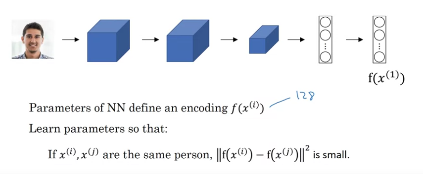
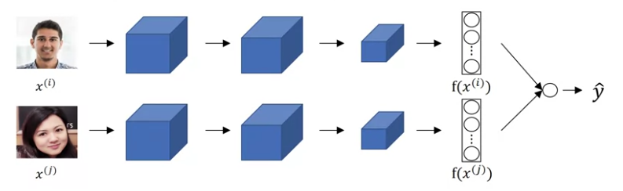
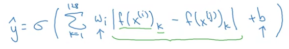
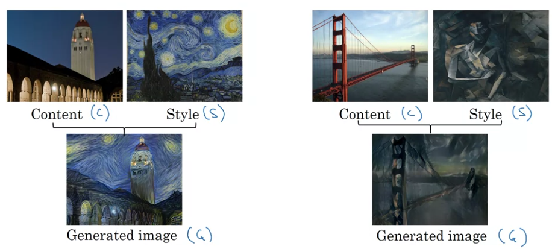
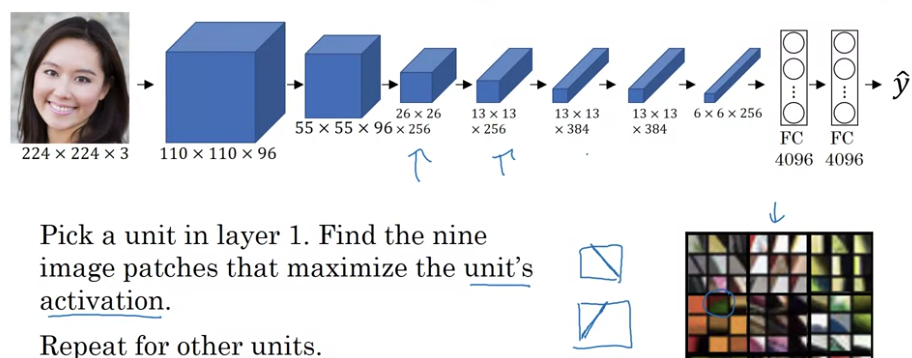
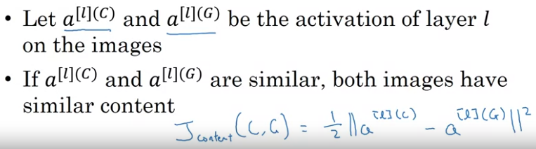
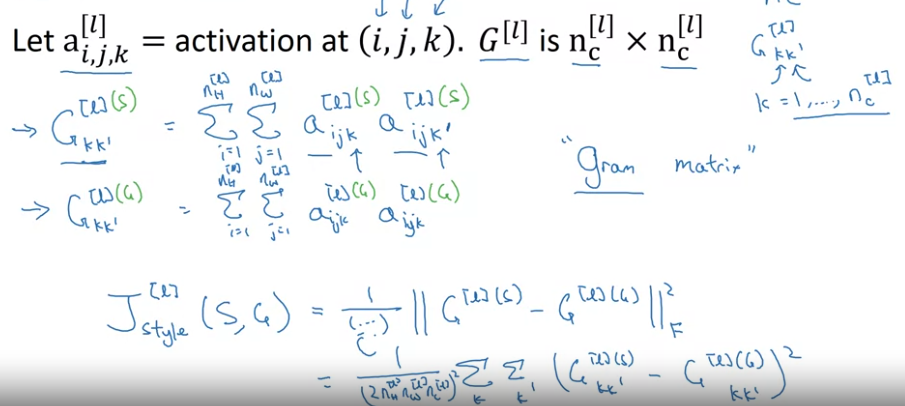

# Week 4 - Special Applications
## Face Recognition vs Face Verification
| Face Recognition | Face Verification |
| :-: | :-: |
| Input image | Input Image + name/ID |
| Has a db to K persons | - |
| Output ID if image belongs to any of the K persons | Output whether the image is of the claimed person |

## One shot Learning
* Recognize person's face using just one example
* Learning a similarity function
  * d(img1, img2) = degree of difference between two images
    * d(img1, img2) <= x -> same person
    * d(img1, img2) \> x -> difference person
* Calculating the similarity between the given image and the images in the database.

## Siamese Network
* Passing 2 inputs through the same network and comparing the output representation - Siamese Network Architecture
  
* `f(.)` represents the encoding of an input through a NN.
* [Deepface: Closing the Gap to Human-Level Performance in Face Verification - Taigman (Siamese Network)](https://www.cs.toronto.edu/~ranzato/publications/taigman_cvpr14.pdf)

## Triplet Loss
* Take 3 images - Anchor(A), Positive(P) and Negative(N)
* We want 
  * `|| f(A) - f(P) ||^2 - || f(A) - f(N) ||^2 <= 0`
  * If the NN outputs 0 or same for everything, the above equation is satisfied. So we add a margin alpha.
  * `|| f(A) - f(P) ||^2 - || f(A) - f(N) ||^2 + alpha <= 0`

* `Loss L(A,P,N) = max(|| f(A) - f(P) ||^2 - || f(A) - f(N) ||^2 + alpha, 0)`
* `Cost J = sum_1^m{L(Ai,Pi,Ni)}`

### Choosing the triplets A,P,N
* Choosing Randomly, A and N will usually be different, so the condition `[d(A,P) + alpha <= d(A,N)]` will be easily satisfied.
* So choose triplets that are **hard** to train on i.e. choose sunch that d(A,P) is almost equal to d(A,N).
* [FaceNet: A Unified Embedding for Face Recognition and Clustering - Schroff](https://arxiv.org/pdf/1503.03832.pdf)

## Face Verification using Binary Classification

* Passing inputs through the same network, calculate similarity and classify according to the output value (0 or 1).
  
* For similarity, we can apply a 
  * Logistic Regression on the units
  * Chi squared similarity
* Choose two images
  * label is 1 if images are of the same person
  * label is 0 if images are of different persons

## Neural Style Transfer
* Convert one style to another
  

### What are Deep ConvNets learning?

### Cost Function
* J(G) = alpha*J_content(C, G) + beta*J_style(S, G)
* Algorithm -
  * Initialize G randomly [100 x 100 x 3]
  * Use gradient descent to minimize J(G)
* [A Neural Algorithm of Artistic Style - Gatys](https://arxiv.org/pdf/1508.06576.pdf)

#### Content Cost Function
* Use a pretrained model, like VGG
* Select any layer,
  *  if l is small, G will be very similar to the C
  *  if l is very large, it will just ensure the objects are present in the G image
  *  usually chosen, somewhere in the middle
*  Calculate hidden unit wise difference between the activations from C and G.
  

#### Style Cost Function
* Choose a layer l's activation
* Define style as correlation between activations across channels.
* Calculate correlation between any two channels of the C image. Calculate correlation between the same channels of the G image.
* Implementation
  * Calculated Style Matrix for content and style image 
  * Frobenius Norm between C and G style matrices
  
  * Use style cost over multiple layers

**Note:** Convolutions can be generalized to 1-D and 3D data.
