# Week 1 
* Applied ML is a highly iterative process.
* Intuitions from one domain do not translate to other domains - depends on data, CPU GPU config.

## Splitting data into Train/Dev/Test sets
* Carve some portion as training set, some to be dev set, and some to be the test set.
* Train on train set, evaluate on dev set, repeat fro multiple times and evaluate the final model on the test set.
* Traditionally, 70-30 or 60-20-20 or splits as data is small.
* In deep learning era, test and dev set size have reduced. Eg. if have 100,000 points, have 30% dev set is unreasonable. More like, 98-1-1 splits

### Mismatched train-test distributions
* the distribution of train and test set should be same. 
* Eg. Train set - cat pictures from web (high quality) Test - cat pictures from app (low quality) will have different distributions.

## Bias-Variance
* Less tradeoff in the Deep learning era.
* In 2-d, one can plot and see bias-variance relationship.
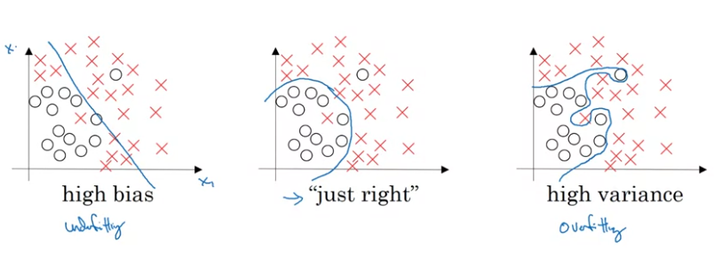
* For NNs, we can analyse bias and variance using Train-Dev Errors.
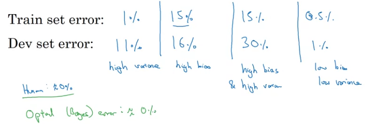
**Note**: In the second column, it is high bias on the assumtion that Human Error(Bayes error) on this task is very low, say 0%.

**Note**: This is under the assumption that Train and Dev sets are from the same distribution

| Condition | Analysis |
| :-: | :- |
| High Bias High Variance | Model is not powerful enough, and it is overfitting on the data |
| High bias Low Variance | Model is not powerful enough, but no overfitting |
| Low Bias High Variance | Model is powerful enough, but overfitting on the train data |
| Low Bias Low Variance | Model is powerful enough and no overfitting |

## Basic Recipe for ML
* Start training with some model.
* Check for *High Bias* i.e. training error, if its large -> try bigger network, more layers, more nodes, training longer
* Check for *High Variance* i.e dev set error, if its large -> get more data, regularization, more appropriate NN architecture (NAS)

## Bias Variance tradeoff
* In pre Deep learning era, "Bias Variance tradeoff" was a problem. We had tools just to reduce bias or just to reduce variance, but those tend to effect the other.
* In Deep learning, 
  * Adding more layers -> reduces bias alomost always
  * Adding more data -> reduces variance almost always

  without effecting the other

## Regularization
Solutions for overfitting or High Variance
* apply Regularization
* Get more training data(Not possible always)

* In LR, apply regularization on the parameters of the model.
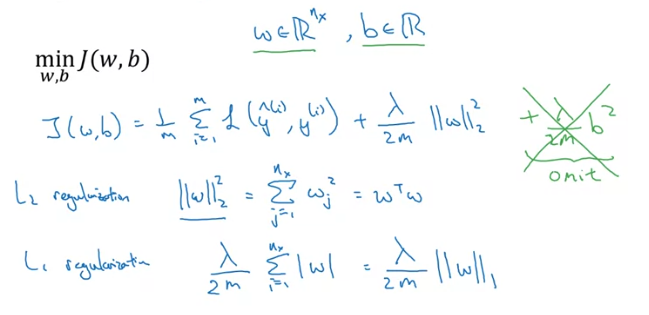
   * **L2 Regularization** - Euclidean norm of the weights scaled with *lambda/2m*, regularization parameter is added to the loss *J*. 
    ```python
                 (lambda/2m)*np.dot(w.T,w)
    ```
   * **L1 Regularization** - L1 norm of the weights scaled with *lambda/2m*, regularization parameter is added to the loss *J*. Using this, w will end up being a sparse matrix (meaning w will have lots of 0's). 
   ```python
               (lambda/2m)*np.sum(np.abs(w))
   ```
**Note:** *lambda* is a hyper parameter. 
**Note:** Usually omit *b*, as it is very less number as compared to *w*.

* Regularization in Neural Networks
   * Add **Frobenius norm** to the loss function of the NN.
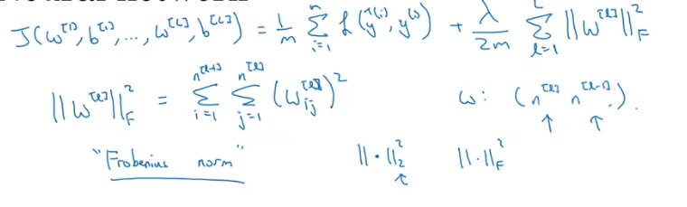

   * **Implementation of L2 Regularization** - During derivative computation of w, dw, add the gradient of the regularization term too.

      So, `dw_l = (from backprop) + (lambda/m)*w_l`

**Note:** L2 Regularization is also called **weight-decay**. As we are making it a little smaller as we subtract the regularization term from w.

### Why Regularization reduces overfitting?
* On penalizing weights, we try to reduce the effect of multiple nodes on the outcome of the NN. That can reduce overfitting.
* Eg: intuition, suppose we have a model with High Variance(overfitting), we have a loss with L2 regularization constant. If this constant is very large, it will push the model weights towards 0, so this new model can be taken as a less complex model, towards the High Bias side, hence reducing overfitting. 
* Eg: intuition, suppose we have a NN with tanh non linearity. If we apply Regularization constant lambda, and its large, the weights will be small and the output of the tanh function will be limited to the linear part. So the NN will move towards being more linear. Hence reducing overfitting.

### Dropout
* With some probability, drop the nodes of each layer of the NN.
* Makes the network simpler on using regularization

#### Implementing Dropout (Inverted dropout) - 
Let's add dropout layer after layer3.
* Output of layer 3 -> *a3*, keep_probs=0.8 (let's say)
* `d3 = np.random.randn(a3.shape[0], a3.shape[1]) < keep_probs`.   
  **Note**: This makes d3 a boolean array but on elementwise multiplication, this will be treated as 0 or 1.
* `a3 = np.multiply(a3, d3)` -> elementwise multiplication
* `s3 /= keep_probs` -> for scaling such that the expected value of z4 doesnt change. (`z4 = np.dot(w4,a3) + b4` and a3 will be reduced bt 20%, so we scale the a3 by 0.8) - This is **inverted dropout**

During test time, we dont use dropout. And we dont need any scaling as we have already used inverted dropout (Scaling during training).

### Why Dropout works?
Intuition - Can't rely on any one feature, so have to spread out weights. 
* As dropout randomly drops out any node, so the output node will try to spread the weights onto other nodes (Shrink weights - adaptive form of L2 regularization but penalty on each weight is different which depends on the activation)

**Note**: keep_prob can be different for different layers.
 
**Note**: Dropout can change the loss plot. 

### Other Regularization Methods
* **Data Augmentation** - Like flipping images, random crops of image, rotations and distortions to characters, in case of OCR.
* **Early Stopping** - 
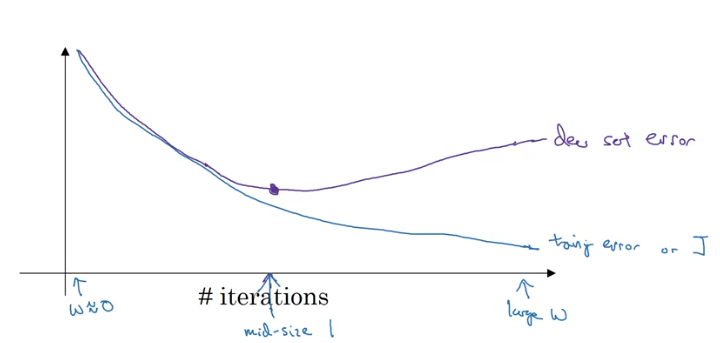
Just stop earlier.
*Note:*Drawback is we are removing orthogonalizing between tasks. Now not overfitting and optimize loss fuction are dependent.

## Normalizing Inputs
* Subtract mean from feature (making it 0 mean)
* Dividing with standard deviation (Normalize variance and making it 1)
   
   **Note**: Normalize test set using the same mean and variance.
### Why normalization?
* Brings inputs to the same scale. So weights will also come to the same scale. The optimization function will be symmetrical and descent will be easier.
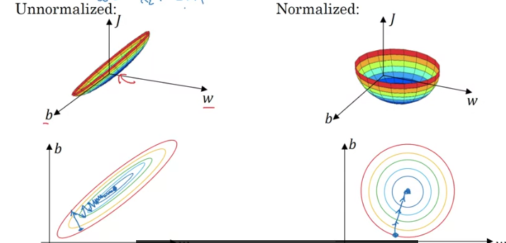

## Vanishing and Exploding Gradients
* While training Deep networks, gradients can become very very big or very very small, making training difficult.
* If weights are larger, and as forward pass requires multiplication of weights number of layers times, so hat{y} will be w^(num_layers).
* Similar with if the weights are smaller, values will be very small.
* And so will the gradients will increase or decrease exponentially.

## Weight Initialization of DNNs
* Partial solution of Exploding or Vanishing gradients

The initialization should depend on the input of that node. More number of inputs, small weights. 
  * If using *ReLU* activation, var=2/n. 
    ```python
        w[l] = np.random.randn(shape)*np.sqrt(2/n[l-1])
    ```
  * If using *tanh* activation, var=1/n. 
    ```python
        w[l] = np.random.randn(shape)*np.sqrt(1/n[l-1]) 
    ```
  * Or 
    ```python
        w[l] = np.random.randn(shape)*np.sqrt(1/(n[l-1]+n[l]))
    ```
## Numerical Approximation of Gradients
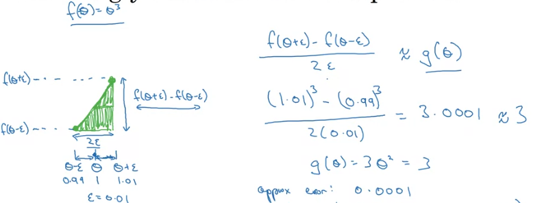

**Note**: Using 2 sided difference gives us better confidence over the gradient. One sided error->O(eps), 2 sided error->O(eps^2) and eps is very small.


## Gradient Checking
* Take all the parameters and reshape them into 1-d vector. 
* Concatenate all the vectors to form 1 giant vector. 
* Do the same for all the gradients also.

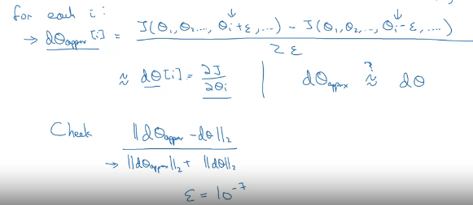
* The euclidean distance by norm value should be as close to epsilon as possible for everything to be perfect.

### Implementation 
* Dont use in training, only to debug, as looping will take a lot of time.
* If grad check fails, check for individual components. Those values which are very far from the original, then there is the problem.
* If applying regularization, use that in grad.
* Doesnt work with Dropout. Use grad_check with keep_prob 1.0, check grad and then turn on dropout.
* Run at random initialization.

# Week 2 - Optimization Algorithms
## Minibatch Gradient Descnt
* Vectorization lets us compute on *m* examples efficiently, slow when *m* is very large.
* Split the whole training set, both X and Y, into smaller sets, called mini-batches.
* **Mini-batch gradient descent** -
  * Run for # mini-batches
    * Use gradient descent on this mini-batch -> Forward prop, compute cost,compute gradients, and update weights.

**Note**: Single pass through the whole training set is **epoch**.

### Implementation and Why this works?
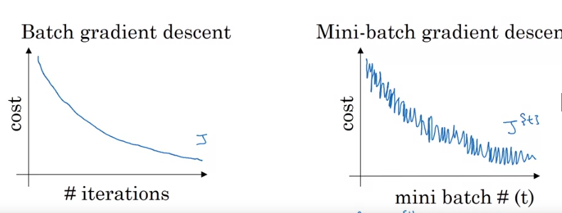

**Note**:The loss for mini-batch GD fluctuates because there is relative difference between the mini-batches.

* Choice of mini-batch size - 
  * If mini-batch size = m, then its just *Batch Gradient Descent*. **Disadvantage** - Takes too much time
  * If mini-batch size = 1, this is *Stochastic Gradient Descent*. Single training example in east step. Stochastic GD will be very noisy. **Disadvantage** - Noisy but than can be taken care of by reducing learning rate, but loses benefits of vectorization.
  * In practice, mini-batch size is between 1 and m. **Advantages** - Parallelization and progress on processing a relatively small number of time.
* If small training set, use batch gradient descent, <2000
* If bigger training set, can  use 64, 128, 256, 512, efficient if its in power of 2. Take not of GPU memory in choosing mini-batch size.

## Exponentially Weighted Averages
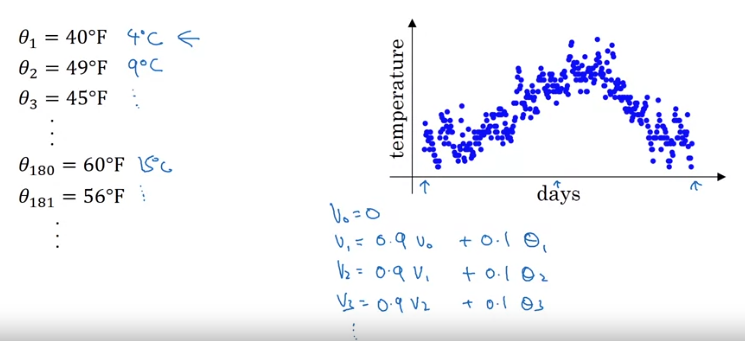

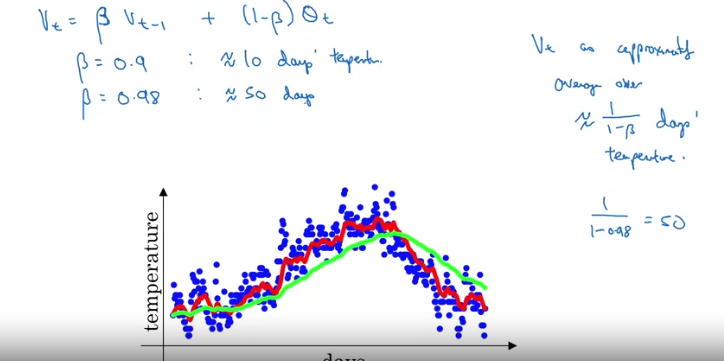

**Note**: Bigger the beta, smoother the curve as averaging over a larger window (more previous values). Drawback being, the average adapts slowly.

**Note**: *beta* being 0.9 means we are averaging over the past 10 values. *beta* being o.98 means we are averaging over the past 50 values.

* Suppose you have data for multiple days. You create an exponentially decaying function(starting from right to left), and multiply the dta points with the points on the exponential function.
* The decay rate of the exponential function depends on *beta*. Higher the *beta*, teh function will decay slower and average will be taken for a longer duration.

### Implementation
* Initializa V=0
* Repeat for each ti,estep *theta{i}*
  * Get thetai{}
  * `V = beta*V + (1 - beta)*theta{i}`

**Note**: Not perfectly accurate. Requires bias correction.

### Bias Correction
As we initalize the model with V=0, the average starts with a much lower value.
* So instead of V{t}, we apply V{t}/(1-*beta*^t). So for lower values of t, this bias correction increases the valueof V{t} while for higher balues og t, it has no effect as *beta*^t will be a very small value.
* Bias correction is helpful in teh warm-up phase (initial phase)

## Gradient Descent with Momentum
* Compute exponentailly weighted averages of the gradients ans use that for updates.
  
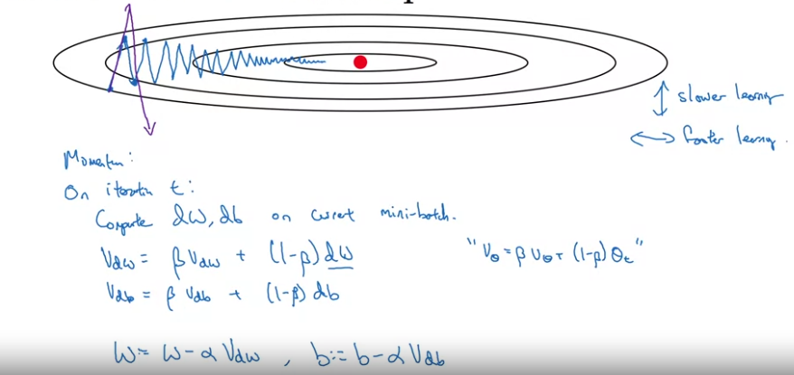
* Without momentum, and somewhat larger learning rate, the descent will be the oscillating line, it will take more steps to reach the minimum.
* The weighted average will smoothen the curve.
* Intuition, let's assume we have a cost function in teh shape of a bowl. We throw a ball from the top and try to reach the bottom.
  * the dW term in teh update will act as acceleration for teh ball.
  * VdW term will act as the momentum/velocity for the ball.
  * The *beta* will act as friction.

### Implementation
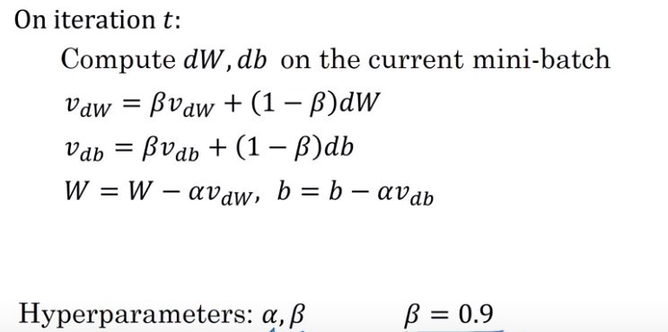
* Initialize VdW=0, same shape as dW
**Note**: Bias Correction is not important as the estimate will get better with just 10 steps of gradient descent.

## RMSprop
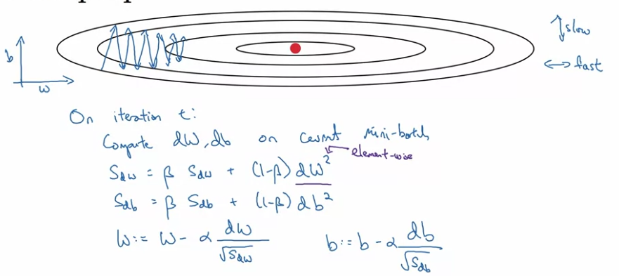
* Root mean square prop
* The updates are done by dividing with the root of SdW (or SdB).
* So the parameters with large gradients(in the fig, the vertical axis) will be updated with a small value (so that it doesnt overshoot/diverge), and the parameters with small gradient will be updated with a large value.

**Note**: While implementing, to avoid divide by zero, we add a really small epsilon to the denominator.

## Adam Optimization
* Adaptive Moment Estimation
* As we use average of the derivatives which is the first moment, and we use average of the square of the derivatives, which is the second moment.

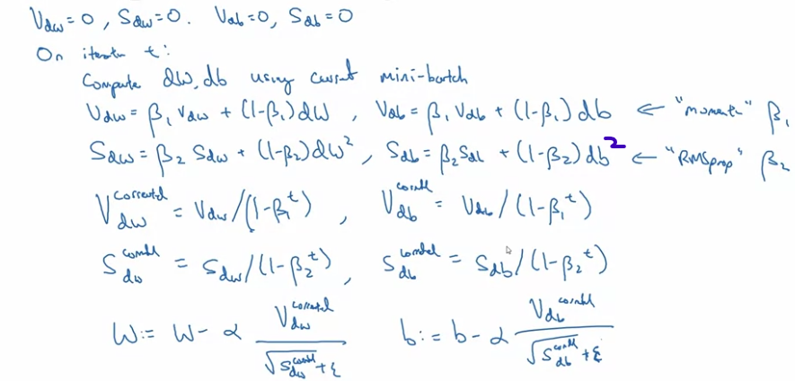

* Hyperparameters:
  * *alpha* -> learning rate -> tune this
  * *beta1* -> parameter for momentum -> 0.9
  * *beta2* -> parameter for RMSprop -> 0.999
  * *epsilon* -> denominator adding term -> 1e-8 (doesnt matter much)

**Note**: Usually fix beta1 and beta2, and tune alpha.

## Learning Rate decay
* Slowly reduce the learning rate as epochs pass.
* So initially, we can take larger steps. When we reach closer to the minimum, we can reduce the learning rate, so we take smaller steps, roam around in a much tighter region near the minimum.
```python
      alpha = [1/(1+decay_rate*epoch_num)]*initial_alpha
      alpha = 0.95**(epoch_num)*initial_alpha # Exponential Decay
      alpha = (k/sqrt(epoch_num))*initial_num
```
* Can use manual decay too.
  
**Note**: Learning rate decay is not that important. Tuning to get a specific alpha can work.

## The problem of local optima
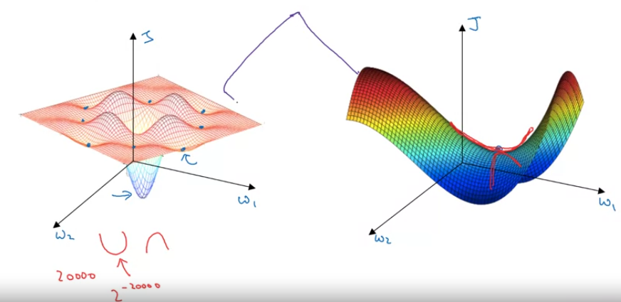
* In NN training, the chances of local minima and local maxima are really really small.

**Note**: *Local minima* -> the curve of all the dimensions are concave(bending down) there.
* The possibility of this happening in a 20,000 dim space is 2^20000 which is really small.
* So its more likely to be stuck at a saddle point.

**Note**: *Saddle Point* -> the curve of some dimensions is curving up and of some dimensions, its curving down.

* So local optima is not a problem.

### Problem of plateaus
* Long regions of space where the gradients are very close to 0. So learning is really slow.
* RMprop, Momentum or Adam can help in speeding up learning.

