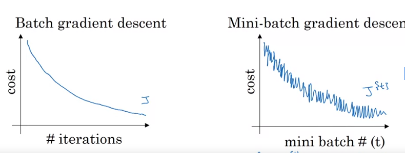
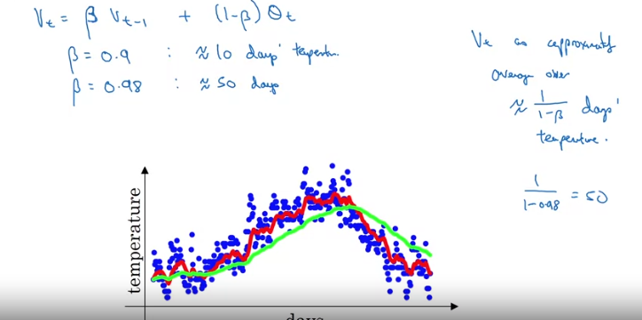
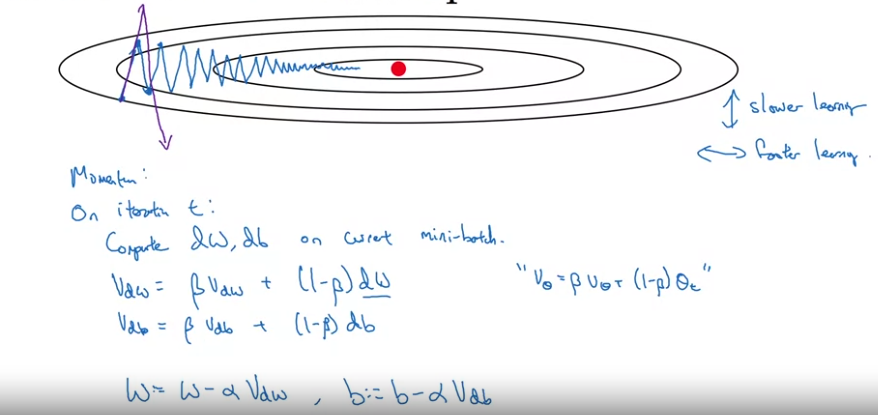
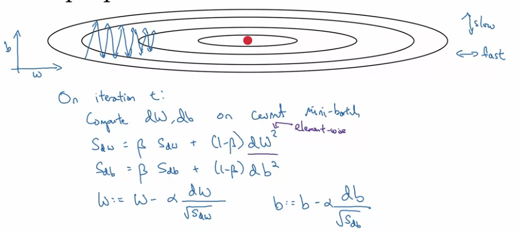
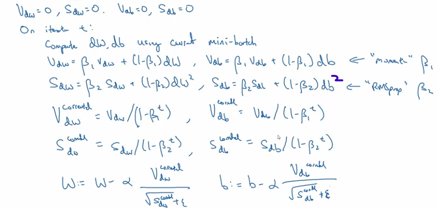
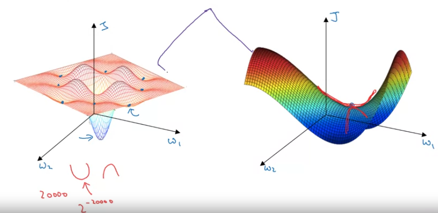

# Week 2 - Optimization Algorithms
## Minibatch Gradient Descnt
* Vectorization lets us compute on *m* examples efficiently, slow when *m* is very large.
* Split the whole training set, both X and Y, into smaller sets, called mini-batches.
* **Mini-batch gradient descent** -
  * Run for # mini-batches
    * Use gradient descent on this mini-batch -> Forward prop, compute cost,compute gradients, and update weights.

**Note**: Single pass through the whole training set is **epoch**.

### Implementation and Why this works?


**Note**:The loss for mini-batch GD fluctuates because there is relative difference between the mini-batches.

* Choice of mini-batch size - 
  * If mini-batch size = m, then its just *Batch Gradient Descent*. **Disadvantage** - Takes too much time
  * If mini-batch size = 1, this is *Stochastic Gradient Descent*. Single training example in east step. Stochastic GD will be very noisy. **Disadvantage** - Noisy but than can be taken care of by reducing learning rate, but loses benefits of vectorization.
  * In practice, mini-batch size is between 1 and m. **Advantages** - Parallelization and progress on processing a relatively small number of time.
* If small training set, use batch gradient descent, <2000
* If bigger training set, can  use 64, 128, 256, 512, efficient if its in power of 2. Take not of GPU memory in choosing mini-batch size.

## Exponentially Weighted Averages




**Note**: Bigger the beta, smoother the curve as averaging over a larger window (more previous values). Drawback being, the average adapts slowly.

**Note**: *beta* being 0.9 means we are averaging over the past 10 values. *beta* being o.98 means we are averaging over the past 50 values.

* Suppose you have data for multiple days. You create an exponentially decaying function(starting from right to left), and multiply the dta points with the points on the exponential function.
* The decay rate of the exponential function depends on *beta*. Higher the *beta*, teh function will decay slower and average will be taken for a longer duration.

### Implementation
* Initializa V=0
* Repeat for each ti,estep *theta{i}*
  * Get thetai{}
  * `V = beta*V + (1 - beta)*theta{i}`

**Note**: Not perfectly accurate. Requires bias correction.

### Bias Correction
As we initalize the model with V=0, the average starts with a much lower value.
* So instead of V{t}, we apply V{t}/(1-*beta*^t). So for lower values of t, this bias correction increases the valueof V{t} while for higher balues og t, it has no effect as *beta*^t will be a very small value.
* Bias correction is helpful in teh warm-up phase (initial phase)

## Gradient Descent with Momentum
* Compute exponentailly weighted averages of the gradients ans use that for updates.
  

* Without momentum, and somewhat larger learning rate, the descent will be the oscillating line, it will take more steps to reach the minimum.
* The weighted average will smoothen the curve.
* Intuition, let's assume we have a cost function in teh shape of a bowl. We throw a ball from the top and try to reach the bottom.
  * the dW term in teh update will act as acceleration for teh ball.
  * VdW term will act as the momentum/velocity for the ball.
  * The *beta* will act as friction.

### Implementation

* Initialize VdW=0, same shape as dW
**Note**: Bias Correction is not important as the estimate will get better with just 10 steps of gradient descent.

## RMSprop

* Root mean square prop
* The updates are done by dividing with the root of SdW (or SdB).
* So the parameters with large gradients(in the fig, the vertical axis) will be updated with a small value (so that it doesnt overshoot/diverge), and the parameters with small gradient will be updated with a large value.

**Note**: While implementing, to avoid divide by zero, we add a really small epsilon to the denominator.

## Adam Optimization
* Adaptive Moment Estimation
* As we use average of the derivatives which is the first moment, and we use average of the square of the derivatives, which is the second moment.



* Hyperparameters:
  * *alpha* -> learning rate -> tune this
  * *beta1* -> parameter for momentum -> 0.9
  * *beta2* -> parameter for RMSprop -> 0.999
  * *epsilon* -> denominator adding term -> 1e-8 (doesnt matter much)

**Note**: Usually fix beta1 and beta2, and tune alpha.

## Learning Rate decay
* Slowly reduce the learning rate as epochs pass.
* So initially, we can take larger steps. When we reach closer to the minimum, we can reduce the learning rate, so we take smaller steps, roam around in a much tighter region near the minimum.
```python
      alpha = [1/(1+decay_rate*epoch_num)]*initial_alpha
      alpha = 0.95**(epoch_num)*initial_alpha # Exponential Decay
      alpha = (k/sqrt(epoch_num))*initial_num
```
* Can use manual decay too.
  
**Note**: Learning rate decay is not that important. Tuning to get a specific alpha can work.

## The problem of local optima

* In NN training, the chances of local minima and local maxima are really really small.

**Note**: *Local minima* -> the curve of all the dimensions are concave(bending down) there.
* The possibility of this happening in a 20,000 dim space is 2^20000 which is really small.
* So its more likely to be stuck at a saddle point.

**Note**: *Saddle Point* -> the curve of some dimensions is curving up and of some dimensions, its curving down.

* So local optima is not a problem.

### Problem of plateaus
* Long regions of space where the gradients are very close to 0. So learning is really slow.
* RMprop, Momentum or Adam can help in speeding up learning.