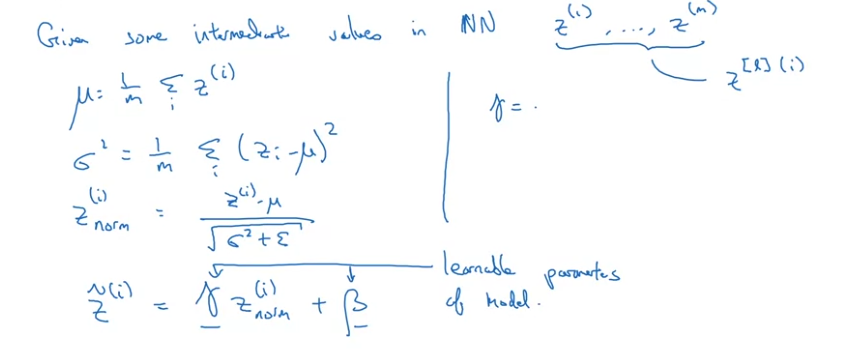
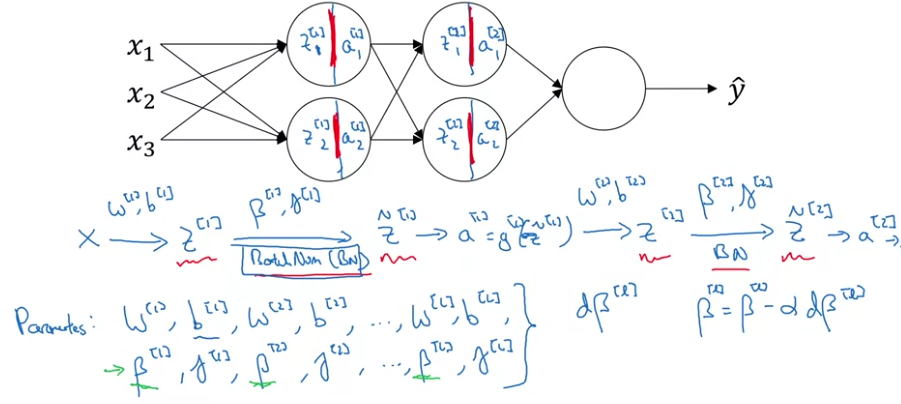
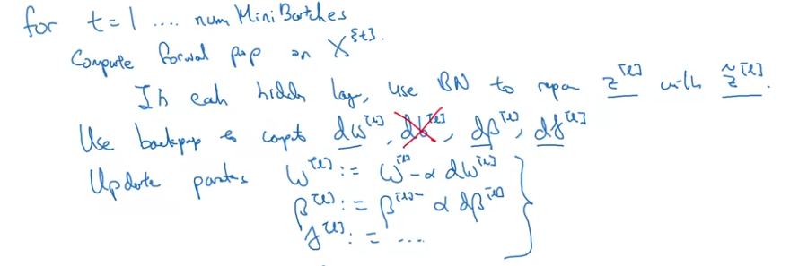
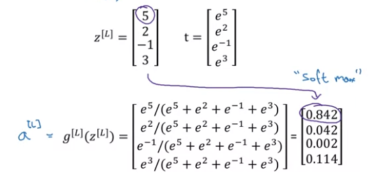

# Week 3 - Parameter Tuning and Batchnorm
## Hyperparameter Tuning
* Multiple hyper-parameters to tune - alpha, beta (momentum), beta1, beta2, epsilon(for ADAM), #layers, #hidden units,  learning rate decay, minibatch_size, #hidden 
* Precedence - 
  * alpha - learning rate
  * beta, #hidden units, mini-batch size
  * #layers, learning rate decay
  * beta1, beta2, epsilon - usually use default values

### Search for hyperparameters
* Try random points, not grid search
* Move Coarse to fine - search in a larger space, get some values which work best and then search finer in the smaller space.
* Choose an appropriate scale to search for hyperparameters.

* Re-test hyperparameters occasionally.
* Pandas vs Caviar approach -
  * **Pandas** - Babysit one model, keep tracking the loss cirve of a single model and tune learning rate or other parameters - usually done when you have less number of resources
  * **Caviar** - Training multiple models with different setting of hyperparameters in parallel and check their progress - usually done when you have more computational resources.

## Batch Normalization
### Normalizing Activations
* Usually normalize input features by reducing mean and scaling with variance, helps in optimizing efficiently.
* Can apply the same in activation of layers in deep models. That's batchnorm.

**Note**: In deep learning, we can either normalize Z or A. Usually, normalization of Z is done.

### Implementing BatchNorm
* Calulate the mean and variance of z (z1, z2, z3...,zm) over a batch for each layer separately.
* Calculate z_morm using `z_norm[i] = (z(i) - mean)/(std_dev+epsilon)` where mean and std_dev are calculated over the batch.
* But this will ensure that the hidden activations have mean 0 and variance 1 which is undesirable.
* So, we calculate `z_tilde(i) = gamma*z_norm(i) + beta`. gamma and beta are learnable parameters of the model. This can help to change the mean and variance of the distribution.
* Use z_tilde(i) instead of z(i).



## Fitting Batchnorm into Deep Network



**Note**: Batchnorm is computed on mini-batches, obviously.

**Note**: If applying batchnorm, we can eliminate bias b[l] for that layer, as we will be subtracting the mean from the layer's activation, and adding the same constant (bias) in (np.dot(W,X) + b), will get eliminated on subtracting the mean.

**Note**: Shape will be (n[l], 1).

### Implementing GD with Batchnorm


* Same as default gradient descent, just update parameters of batchnorm layer also.

## Why does batchnorm works?
* As normalizing the input layer helps bring inputs to the same scale, similar can be done for activations of the hidden layers, as they are also inputs to the following hidden layer. 
* *Learning on shifting input distribution* - like having a cat classifier trained on only black cats, without batchnorm, it will not work on cats with other color. This is **covariate shift**.
  * **Covariate Shift** -> change in the data distribution, and and we have a mapping X -> Y, if the distribution of X changes, we need to train the model again for this new distribution, evven though the funtion f(X->Y) remains same.
  * NNs suffer from covariate shift, as from a hidden layers' perspective, the inputs keep changing all the time as we are constantly updating the parameters. 
  * Batchnorm makes the layer robust to the changes in the previous layers weights, with the help of parameters beta and gamma. Even though the true mean and variance of the inputs to a layer changes, their effect on the current layer reduces.
  * This leads of decoupling of layers. Leads to faster learning
* *Regularization* - As we calculate mean and variance over a minibatch, it is somewhat noisy. So the process of converting z to z_tilde is noisy too, hence some regularization effect.

## Batchnorm at test time
* During training, we use the mean and variance of the batch.
* During test time, we dont have a batch.
* During training, we calculate the **exponentially weighted average of the means and variances** of all the batches. Use that exponentially averaged value for normalization.

## Multi-class classification - Softmax Regression
* Generalizaion of Logistic Regression to C classes.
* C -> #classes
* Softmax gives probabilities of each class given the input {P(Y=i|X)}. To get the probs, we need to normalize, hence the division by `np.sum(Z[L])`
* To calculate softamx - 
  ```python
        Z[L] = np.dot(W[L], A[L-1]) + B[zL]
        T = np.exp(Z[L])
        A[L] = T[L]/np.sum(T[L])
  ```

### Training a Softmax Classifier
#### Softmax Activation

#### Loss Function
`L{(y_hat, y) = -1*np.sum(y*np.log(y_hat))`  which,in multiclass classification where true label will have `1` at only a single index, will boil down to `-1*y[i]*np.log(y_hat[i]) => -1*np.log(y_hat[i])`. So the optimization alog will try to maximize `np.log(y_hat[i])` i.e. increasing the probability of the true label.

**Note**: this is Maximum Likelihood Estimation (MLE).

* For backprop, the initialization `dZ[L] = y_hat - y`

## Deep Learning Frameworks
* Criteria for selecting DL framework -
  * Ease of development
  * Running speed
  * Truly open source

### Tensorflow
* Let's minimize the cost function `J = w**2 - 10*w + 25`
```python
      import numpy as np
      import tensorflow as tf
      
      w = tf.Variable(0, dtype=tf.float32)
      cost = tf.add(w**2, tf.multiply(-10, w), 25)
      train = tf.train.GradientDescentOptimizer(0.01).minimize(cost)
      
      init = tf.global_variables_initializer()
      session = tf.Session()
      session.run(init)
      print(session.run(w)) # -> 0.0

      session.run(train) # 1 step of gradient descent
      print(session.run(w)) # ->  0.1

      for i in range(1000):
        session.run(train)
      print(session,run(w)) # ->  4.99999

      cost = x[0][0]*w**2 + x[1][0]*w + x[2][0]
      coefficients = np.array([[1.], [-10.], [25.]]) # data to feed
      x = tf.placeholder(tf.float32, [3,1]) # to store data afterwards
      session.run(train, feed_dict={x:coefficients}) # to provide data into the algo
```
