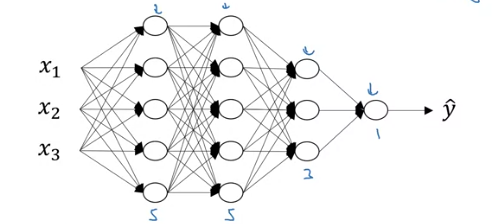
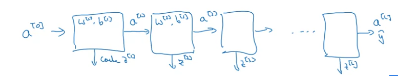
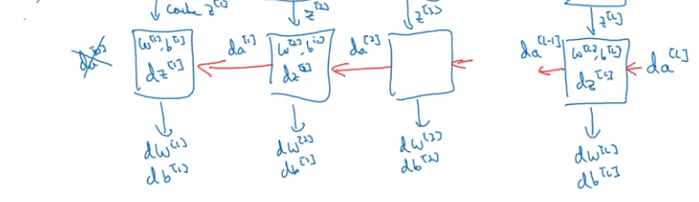

# Week 1 - Introduction
Just a basic introduction to Deep Learning, and why its getting the tread in recent times.

# Week 2 - Logistic Regression as Neural Network
Logistic Regression - algorithm for binary classification. Eg. image has a cat(1) or no-cat(0). x->image, y->output label.

* **Image as input** -> red, green and blue color channels. So image of 64x64 will have 3x64x64 matrix of pixel intensity values. Convert into 1-d input vector -> **n**-dim.
* **Label as output** -> 1 value for each input -> **1**-dim.

**Notation:**
* (x,y) - single trianing example 
* Training examples - (x1,y1)...(xm,ym) -> m training examples
* X matrix to denote all input; stacking all inputs into columns; X = [x1,x2,...,xm]; so matrix dim *n x m*.
* Y matrix to denote all labels - stack all labels into columns; Y = [y1,y2...ym]; so matrix dim *1 x m*.
* Stacking into columns helps in easier implementation.

## Binary Classification - 
Given x, want hat{y}=P(y=1|x); x is n-dim, so paramters *w* of the LR model will be n-dim with bias b, a real number.

For linear regression - hat{y} = wTx + b. This cant give us probability.

So LR gives hat{y}=sigmoid(wTx + b).

|  |  |
| :-: | :-: |

**Note**: In NN programming, we keep w and b separate, while, we can also merge them together and append a 1 to the input.

Loss - L(hat{y},y) - used to measure how good our output hat{y} is as compared to y.

**Note**: Squared error in case of LR makes the loss function non-convex.

Instead we use
``` 
L(hat{y},y) = -y*log(hat{y}) + (1-y)*log(1-hat{y})
```


**Cost function** - J(w,b) = 1/m* *sum_i=1^m*(L(hat{yi},yi))

So, want to find w,b to minimize the cost function.


## Gradient Descent 
Taking a step downhill steepest descent.

|  |  |
| :-: | :-: |

For each time-step, 
  * for the current setting of the parameters, find the gradient (which tells us the slope)
  * move in the opposite direction of slope so as to reduce our cost function


## Computation Graph & Derivatives - 
Neural Network does 2 steps - 
*Forward Pass* - give input, compute outputs
*Backward Pass* - compute derivatives, update parameters

Divide the overall computation into individual steps, that forms the computation graph. Helps in calculation of the final variable (J).


To calculate dH/dv -> easiar as J is a function of v.

To calculate dJ/da -> need to apply chain rule, as J is a function of v, and v is a function of a.

So first calculate how much v changes on changing a, then how much J changes in changing v.
```
    so dJ/da = (dJ/dv).(dv/da)
```
**Note**: In code, (dJ/dv) will be represented by dv, as we will be computing the derivative of J only with every variable.

## Application of Gradient Descent for Logistic Regression - 


* Not efficient, as for multiple variables, we will have to apply another loop inside the main loop. So apply **Vectorization**.

## Vectorization - 
* Dot Product - `np.dot(A,b)`
* Exponentiation - `np.exp(v)`
* np.log, np.abs, np.maximum, 1/v, v**2 -> power, a\*b->elementwise product 
* `dw = np.zeros((n,1))`
* `dw += xi*dz[i]`

## Vectorization of Logistic Regression -

### Forward Pass
| Item | Description | Shape | 
| --- | --- | --- |
| X = [x1,x2,....xm] | Stack input vectors columnwise | *n x m* |
| w = [w1,w2,...,wn].T |  Column vector |  *n x 1* |
| b  | Bias | Scalar |
| Z = [z1,z2,...,zm] | `np.dot(w.T,X) + b` | *1 x m* |
| A = [a1,a2,....,am] | `sigmoid(Z)` | *1 x m* |

**Note**: b here a scaler, but python uses broadcasting and converts it into vector. (Shape: *1 x m*)

### Backward Pass
| Item | Description | Shape | 
| --- | --- | --- | 
| Y = [y1,y2....,ym] | Output | *1 x m* |
| dZ = [dz1,dz2,...,dzm] | Calculate Gradients `dZ = A - Y` | *1 x m* |
| db | Calculate Gradients `db = 1/m*np.sum(dZ)` | Scalar
| dw = [dw1,dw2,...,dwn].T | Calculate Gradients `dw = 1/m*np.dot(X,dZ.T)` | *n x 1* |
| w | Update `w -= alpha*dw` | *n x 1* | -> 
| b | Update `b -= alpha*db` | Scalar | 

**Note**: alpha - learning rate

## Broadcasting - 


**Tips for broadcasting** 
* While making a column/row vector, explicitly define the shape of the vector. Eg. `a = np.random.randn(5,1)` instead of `a = np.random.randn(5)`.
  * `a = np.random.randn(5)` -> gives a rank 1 array which can behave like a row/column vector
* Use assertion statements to make sure the shapes of matrices -> `assert(a.shape == (5,1))`
* use reshape to make sure about the shapes of the matrices, reshape is an inexpensive operation. 

# Week 3 - Shallow Neural Networks
## Neural Network Overview
Similar to Logistic Regression as we saw earlier, but sigmoid(wTx+b) happens multiple times with different w's. These w's are the parameters of the *layers* of the NN.

## Representation
Single Hidden layer - 


* Each layer's output represented by `a[i]`. So, `a[0]=X`.
* Hidden layer's output will be a[1] and so on.
* In the fig., shape of a[1] is (*4 x 1*).

**Note**: This is a two layer NN, input layer is not counted as a official layer.

Hidden layers and output layer has parameters. In this case, w[1] and b[1].

Shape of w[1] -> (*4 x 3*); 4-> # of nodes in the layer; 3-> # of input features

## Computing Output and Vectorizing operations

```python
    z[i] = np.dot(w.T,x) + b
    a[i] = sigmoid(z[i]) (output of 1 node)
```
Vectorize node computation - Each node computes `sigmoid(np.dot(w.T,x) + b)`, there are 4 nodes, so stack these 4 row vectors to form a matrix.

So shape will be (*4 x n*)

Now *n* depends on the shape of the input. Here, input is (*3 x 1*). So shape of the weight matrix **W1** will be (*4 x 3*).

So `np.dot(W1,x)` will be of shape (*4 x 1*) corresponding to z[i] of each node in the layer.


## Vectorizing across multiple inputs
We have *m* training examples.


* Take training examples and stack them in columns. X matrix. So shape (*n x m*)
* This will give us Z of shape (*n x m*), as we will have computed Z for all the m-training examples and they will be stacked together.
**Note**: Horizontal Index corresponds to training examples. Vertical index corresponds to nodes of the NN.


## Activation Functions
Until now we have seen sigmoid activation function.

**tanh** -> shifted version of sigmoid function. always better than sigmoid. as it centers the data. 0 mean and 1 variance.
Except for output layer, depends on the task, eg. for binary classification, we need a value between 0 and 1. SO use sigmoid.

*Drawback of exponential Activations* - if z very large or very small, gradients become 0 and they are flat at extreme values, so learning becomes very slow.

Popular choice - **ReLU** - Rectified Linear Unit
Gradient is always 1 for z>0. But for z<0, gradient is 0. That's a drawback. 

Solution - **Leaky ReLU**. When z<0, there is a slight slope so that the gradient is not 0.

**Note:**: USE ReLU. Learning is faster as slope is 1 always. Most of the z's in the layer will be >0, so learning will still be there.


## Why use activation function?
Multiple linear layers can be composed into a single linear layer. So activation/non-linearity is needed.

Can be used in the output layer if we need a real value instead of capped values.

Derivatives - 
* sigmoid -> `sig(z)(1-sig(z))`


* tanh -> `1 - sq{tanh(x)}`


* ReLU -> `1 if z>=0; 0 if z<0`
* Leaky ReLU ->  `1 if z>-0; 0.01 if z<0`


## Gradient Descent for NN - Backpropagation
 

Explanation - 
 

 ## Initialization
 If initializing weights with 0's, Activations will be same, hence gradients will be same too. So weight changes will be same. Will lead to symmetric hidden units.
 
 ### Random Initialization - 

 ```python
    w = np.random.randn((2,2)) * 0.01
 ```
 Note: 0.01 because we want weights to be small, as exponential activation functions have low slope on larger values.
```python
    b = np.zeros((2,1))
``` 
 b can be initialized with 0's, b's do not have the symmetry problem. Its called **symmetry breaking** problem.

# Week 4 - Deep Neural Network
## Notation


| Description | Value |
| --- | --- |
| Number of Layers | *L* -> Eg. L=4 |
| Number of nodes in layer l | `n[l]` -> `n[0] = 3,n[1] = 5,n[2] = 5,n[3] = 4` |
| Activations for layer l | `a[l] = g[l](z[l])` |
| Weights for layer l | `W[l]` |
| Biases for layer l | `b[l]` |
| Linear Activation for layer l | `z[l] = np.dot(W[l],a[l-1]) + b[l]` |    
| Activation function for layer l | `g[l](.)` |
| Input Features X | `a[0] = X` |
| Output | `Y_hat = a[L]` |

## Forward Propagation
For l=1 to L:
* `z[l] = np.dot(W[l],a[l-1] + b[l]`
* `a[l] = g[l](z[l])`

## Matrix Dimensions
| Matrix | Shape |
| --- | --- |
| `W[l]` | `(n[l],n[l-1])` |
| `b[l]` |  `(n[l],1)` |

* Shape of dW = Shape of W
* Shape of db = Shape of b

### Vectorized Implementation
* Shape of weights remains same
* Shape of `Z[l] = (n[l],m)`

* Shape of `A[l]` = Shape of `Z[l]`
* In vectorized implementation also, Shape of `b[l]` is `(n[l],1)` as it will use python broadcasting to be of the required dimensions.  

* Shape of dZ = Shape of Z
* Shape of dA = Shape of A

## Why Deep Representations
* Earlier layers learning simpler functions, later layers learning complex features/functions.
* Eg. in face recognition images -> first layer can detect edges, second layer can detect shapes like eyes, nose etc, third layer can detect most parts of the face.
* Eg. in speech, the first layer can learn tones in the speech, second layer con learn the basic unit of speech called phonemes, third layer can learn words, and subsequently learn phrases. 
* Computing same function with more number of layers with less number of nodes, against less number of layers, the model with less number of layers will require exponentially large number of nodes. Eg. calculating parity of x1,x2...,xn

## Building blocks for DNN
* Layer l, W[l], b[l]
* **Forward**:

  * *Input*: `A[l-1]`, *Output*: `A[l]`, cache(`Z[l]`,`W[l]`,`b[l]`)
  * *Initialization*: `A[0]=X`
  * `Z[l] = np.dot(W[l]A[l-1]) + b[l]`; keep caching `Z[l]` (for backprop)
  * `A[l] = g[l](Z[l])`
* **Backward**:

  * *Input*: `dA[l]` and cache (`Z[l]`,`W[l]`,`b[l]`) *Output*: `dA[l-1]`, `dW[l]` and `db[l]`
  * *Initialization*: `dA[L] = -(y/a) + (1-y)/(1-a)` [For Logistic Regression, binary classification]
  * `dZ[l] = dA[l]*g'[l](Z[l])` ( ' -> Derivative of activation fucntion)
  * `dW[l] = np.dot(dZ[l], A[l-1].T)/m`  
  * `db[l] = np.sum(dZ[l], axis=1, keepdims=True)/m`
  * `dA[l-1] = np.dot(W[l].T,dZ[l])`
  * Hence, `dZ[l] = np.dot(W[l+1].T,dZ[l+1])\*g'\[l\](Z[l])`
* Update:
  * dA[l-1] will be used for backpop.
  * dW[l] will update W as per `W = W[l] - alpha*dW[l]`
  * db will update b as per `b = b[l] - alpha*db[l]`.

**Note:** cache will store W and b in addition to Z, for easier implementation.

## Parameters and Hyperparameters
* Parameters are weights and biases. Eg. `W[1]`,`b[1]`,`W[2]`,`b[2]` etc.
* Hyperparameters: parameters that control W and b
  * Learning Rate (alpha)
  * Number of iterations
  * Number of Hidden layers L
  * Number of hidden units `n[1]`,`n[2]`
  * Choice of activation functions
  * Momentum
  * Regularization parameters
  * Minibatch size
   
* Applied Deep learning is an emperical process. Try various things and check what works.