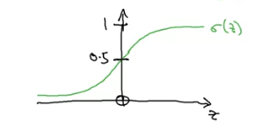
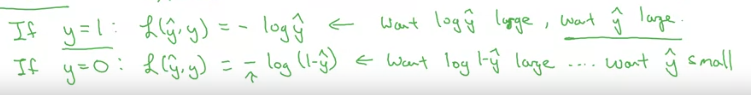
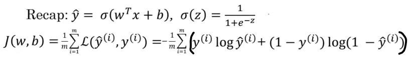
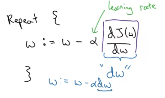
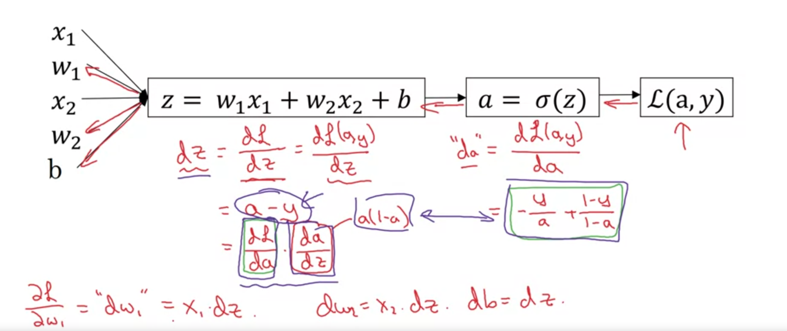
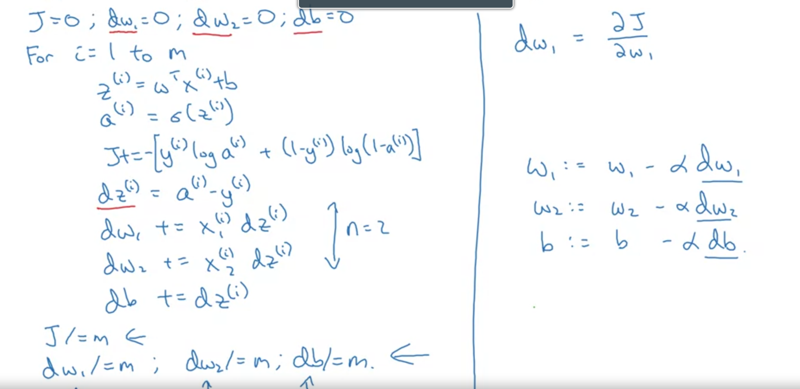
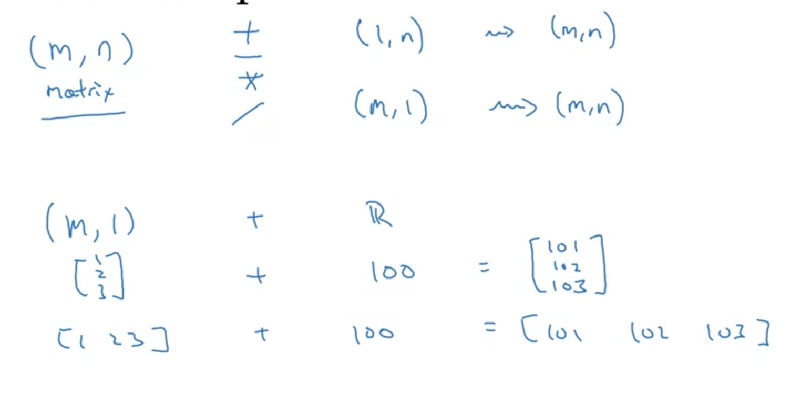

# Week 2 - Logistic Regression as Neural Network
Logistic Regression - algorithm for binary classification. Eg. image has a cat(1) or no-cat(0). x->image, y->output label.

* **Image as input** -> red, green and blue color channels. So image of 64x64 will have 3x64x64 matrix of pixel intensity values. Convert into 1-d input vector -> **n**-dim.
* **Label as output** -> 1 value for each input -> **1**-dim.

**Notation:**
* (x,y) - single trianing example 
* Training examples - (x1,y1)...(xm,ym) -> m training examples
* X matrix to denote all input; stacking all inputs into columns; X = [x1,x2,...,xm]; so matrix dim *n x m*.
* Y matrix to denote all labels - stack all labels into columns; Y = [y1,y2...ym]; so matrix dim *1 x m*.
* Stacking into columns helps in easier implementation.

## Binary Classification - 
Given x, want hat{y}=P(y=1|x); x is n-dim, so paramters *w* of the LR model will be n-dim with bias b, a real number.

For linear regression - hat{y} = wTx + b. This cant give us probability.

So LR gives hat{y}=sigmoid(wTx + b).

|  |  |
| :-: | :-: |

**Note**: In NN programming, we keep w and b separate, while, we can also merge them together and append a 1 to the input.

Loss - L(hat{y},y) - used to measure how good our output hat{y} is as compared to y.

**Note**: Squared error in case of LR makes the loss function non-convex.

Instead we use
``` 
L(hat{y},y) = -y*log(hat{y}) + (1-y)*log(1-hat{y})
```


**Cost function** - J(w,b) = 1/m* *sum_i=1^m*(L(hat{yi},yi))

So, want to find w,b to minimize the cost function.



## Gradient Descent 
Taking a step downhill steepest descent.

|  |  |
| :-: | :-: |

For each time-step, 
  * for the current setting of the parameters, find the gradient (which tells us the slope)
  * move in the opposite direction of slope so as to reduce our cost function


## Computation Graph & Derivatives - 
Neural Network does 2 steps - 
*Forward Pass* - give input, compute outputs
*Backward Pass* - compute derivatives, update parameters

Divide the overall computation into individual steps, that forms the computation graph. Helps in calculation of the final variable (J).


To calculate dH/dv -> easiar as J is a function of v.

To calculate dJ/da -> need to apply chain rule, as J is a function of v, and v is a function of a.

So first calculate how much v changes on changing a, then how much J changes in changing v.
```
    so dJ/da = (dJ/dv).(dv/da)
```
**Note**: In code, (dJ/dv) will be represented by dv, as we will be computing the derivative of J only with every variable.

## Application of Gradient Descent for Logistic Regression - 




* Not efficient, as for multiple variables, we will have to apply another loop inside the main loop. So apply **Vectorization**.

## Vectorization - 
* Dot Product - `np.dot(A,b)`
* Exponentiation - `np.exp(v)`
* np.log, np.abs, np.maximum, 1/v, v**2 -> power, a\*b->elementwise product 
* `dw = np.zeros((n,1))`
* `dw += xi*dz[i]`

## Vectorization of Logistic Regression -

### Forward Pass
| Item | Description | Shape | 
| --- | --- | --- |
| X = [x1,x2,....xm] | Stack input vectors columnwise | *n x m* |
| w = [w1,w2,...,wn].T |  Column vector |  *n x 1* |
| b  | Bias | Scalar |
| Z = [z1,z2,...,zm] | `np.dot(w.T,X) + b` | *1 x m* |
| A = [a1,a2,....,am] | `sigmoid(Z)` | *1 x m* |

**Note**: b here a scaler, but python uses broadcasting and converts it into vector. (Shape: *1 x m*)

### Backward Pass
| Item | Description | Shape | 
| --- | --- | --- | 
| Y = [y1,y2....,ym] | Output | *1 x m* |
| dZ = [dz1,dz2,...,dzm] | Calculate Gradients `dZ = A - Y` | *1 x m* |
| db | Calculate Gradients `db = 1/m*np.sum(dZ)` | Scalar
| dw = [dw1,dw2,...,dwn].T | Calculate Gradients `dw = 1/m*np.dot(X,dZ.T)` | *n x 1* |
| w | Update `w -= alpha*dw` | *n x 1* | -> 
| b | Update `b -= alpha*db` | Scalar | 

**Note**: alpha - learning rate

## Broadcasting - 


**Tips for broadcasting** 
* While making a column/row vector, explicitly define the shape of the vector. Eg. `a = np.random.randn(5,1)` instead of `a = np.random.randn(5)`.
  * `a = np.random.randn(5)` -> gives a rank 1 array which can behave like a row/column vector
* Use assertion statements to make sure the shapes of matrices -> `assert(a.shape == (5,1))`
* use reshape to make sure about the shapes of the matrices, reshape is an inexpensive operation. 
