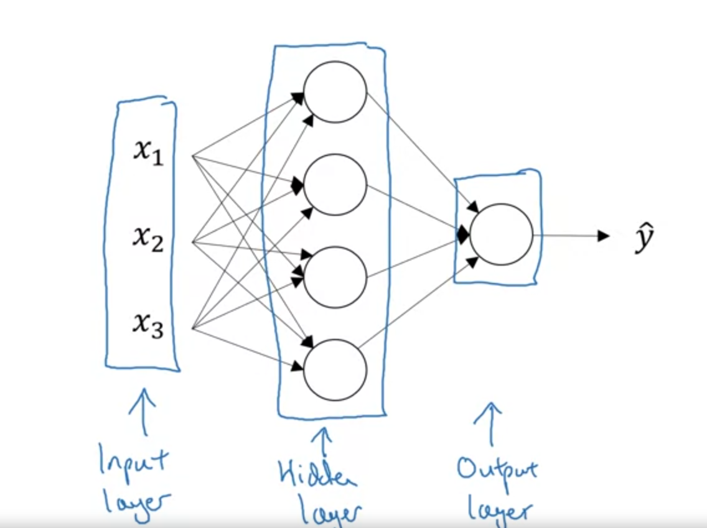
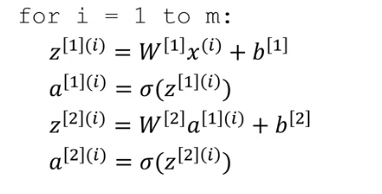
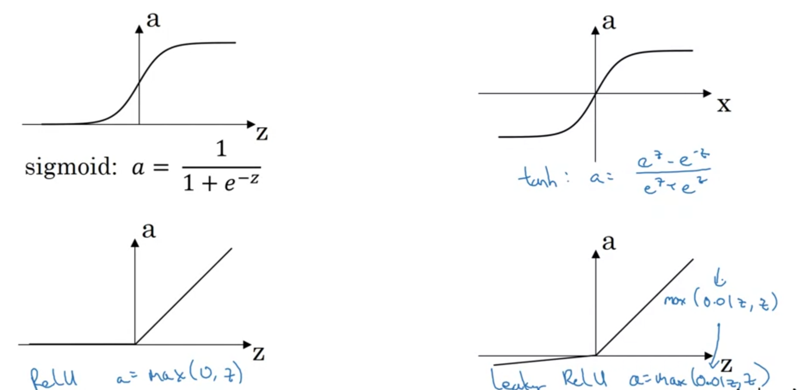
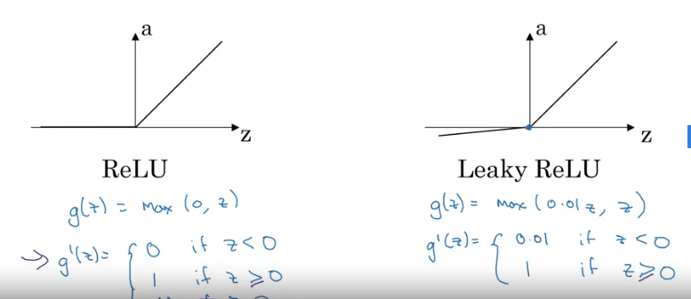
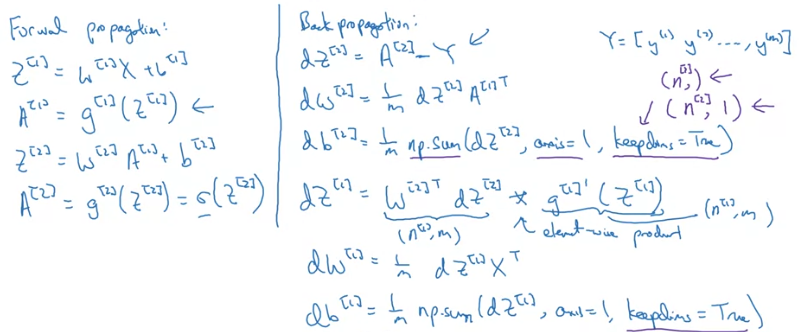
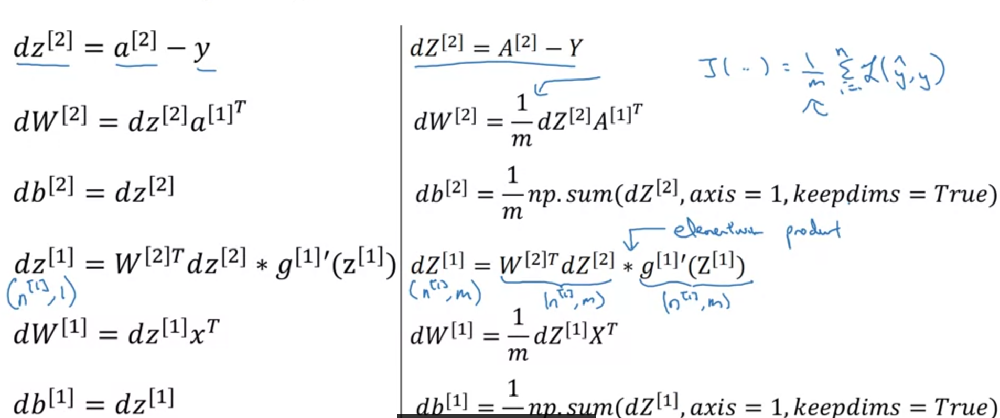

# Week 3 - Shallow Neural Networks
## Neural Network Overview
Similar to Logistic Regression as we saw earlier, but sigmoid(wTx+b) happens multiple times with different w's. These w's are the parameters of the *layers* of the NN.

## Representation
Single Hidden layer - 



* Each layer's output represented by `a[i]`. So, `a[0]=X`.
* Hidden layer's output will be a[1] and so on.
* In the fig., shape of a[1] is (*4 x 1*).

**Note**: This is a two layer NN, input layer is not counted as a official layer.

Hidden layers and output layer has parameters. In this case, w[1] and b[1].

Shape of w[1] -> (*4 x 3*); 4-> # of nodes in the layer; 3-> # of input features

## Computing Output and Vectorizing operations

```python
    z[i] = np.dot(w.T,x) + b
    a[i] = sigmoid(z[i]) (output of 1 node)
```
Vectorize node computation - Each node computes `sigmoid(np.dot(w.T,x) + b)`, there are 4 nodes, so stack these 4 row vectors to form a matrix.

So shape will be (*4 x n*)

Now *n* depends on the shape of the input. Here, input is (*3 x 1*). So shape of the weight matrix **W1** will be (*4 x 3*).

So `np.dot(W1,x)` will be of shape (*4 x 1*) corresponding to z[i] of each node in the layer.


## Vectorizing across multiple inputs
We have *m* training examples.



* Take training examples and stack them in columns. X matrix. So shape (*n x m*)
* This will give us Z of shape (*n x m*), as we will have computed Z for all the m-training examples and they will be stacked together.
**Note**: Horizontal Index corresponds to training examples. Vertical index corresponds to nodes of the NN.


## Activation Functions
Until now we have seen sigmoid activation function.

**tanh** -> shifted version of sigmoid function. always better than sigmoid. as it centers the data. 0 mean and 1 variance.
Except for output layer, depends on the task, eg. for binary classification, we need a value between 0 and 1. SO use sigmoid.

*Drawback of exponential Activations* - if z very large or very small, gradients become 0 and they are flat at extreme values, so learning becomes very slow.

Popular choice - **ReLU** - Rectified Linear Unit
Gradient is always 1 for z>0. But for z<0, gradient is 0. That's a drawback. 

Solution - **Leaky ReLU**. When z<0, there is a slight slope so that the gradient is not 0.

**Note:**: USE ReLU. Learning is faster as slope is 1 always. Most of the z's in the layer will be >0, so learning will still be there.



## Why use activation function?
Multiple linear layers can be composed into a single linear layer. So activation/non-linearity is needed.

Can be used in the output layer if we need a real value instead of capped values.

Derivatives - 
* sigmoid -> `sig(z)(1-sig(z))`


* tanh -> `1 - sq{tanh(x)}`


* ReLU -> `1 if z>=0; 0 if z<0`
* Leaky ReLU ->  `1 if z>-0; 0.01 if z<0`



## Gradient Descent for NN - Backpropagation
 

Explanation - 
 

 ## Initialization
 If initializing weights with 0's, Activations will be same, hence gradients will be same too. So weight changes will be same. Will lead to symmetric hidden units.
 
 ### Random Initialization - 

 ```python
    w = np.random.randn((2,2)) * 0.01
 ```
 Note: 0.01 because we want weights to be small, as exponential activation functions have low slope on larger values.
```python
    b = np.zeros((2,1))
``` 
 b can be initialized with 0's, b's do not have the symmetry problem. Its called **symmetry breaking** problem.