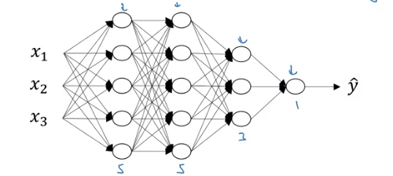
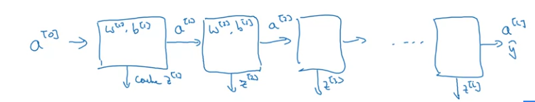
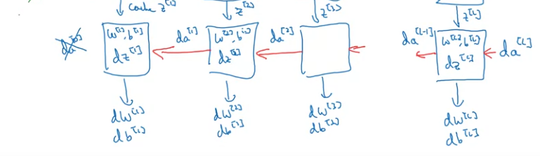

# Week 4 - Deep Neural Network
## Notation

| Description | Value |
| --- | --- |
| Number of Layers | *L* -> Eg. L=4 |
| Number of nodes in layer l | `n[l]` -> `n[0] = 3,n[1] = 5,n[2] = 5,n[3] = 4` |
| Activations for layer l | `a[l] = g[l](z[l])` |
| Weights for layer l | `W[l]` |
| Biases for layer l | `b[l]` |
| Linear Activation for layer l | `z[l] = np.dot(W[l],a[l-1]) + b[l]` |    
| Activation function for layer l | `g[l](.)` |
| Input Features X | `a[0] = X` |
| Output | `Y_hat = a[L]` |

## Forward Propagation
For l=1 to L:
* `z[l] = np.dot(W[l],a[l-1] + b[l]`
* `a[l] = g[l](z[l])`

## Matrix Dimensions
| Matrix | Shape |
| --- | --- |
| `W[l]` | `(n[l],n[l-1])` |
| `b[l]` |  `(n[l],1)` |

* Shape of dW = Shape of W
* Shape of db = Shape of b

### Vectorized Implementation
* Shape of weights remains same
* Shape of `Z[l] = (n[l],m)`

* Shape of `A[l]` = Shape of `Z[l]`
* In vectorized implementation also, Shape of `b[l]` is `(n[l],1)` as it will use python broadcasting to be of the required dimensions.  

* Shape of dZ = Shape of Z
* Shape of dA = Shape of A

## Why Deep Representations
* Earlier layers learning simpler functions, later layers learning complex features/functions.
* Eg. in face recognition images -> first layer can detect edges, second layer can detect shapes like eyes, nose etc, third layer can detect most parts of the face.
* Eg. in speech, the first layer can learn tones in the speech, second layer con learn the basic unit of speech called phonemes, third layer can learn words, and subsequently learn phrases. 
* Computing same function with more number of layers with less number of nodes, against less number of layers, the model with less number of layers will require exponentially large number of nodes. Eg. calculating parity of x1,x2...,xn

## Building blocks for DNN
* Layer l, W[l], b[l]
* **Forward**:

  * *Input*: `A[l-1]`, *Output*: `A[l]`, cache(`Z[l]`,`W[l]`,`b[l]`)
  * *Initialization*: `A[0]=X`
  * `Z[l] = np.dot(W[l]A[l-1]) + b[l]`; keep caching `Z[l]` (for backprop)
  * `A[l] = g[l](Z[l])`
* **Backward**:

  * *Input*: `dA[l]` and cache (`Z[l]`,`W[l]`,`b[l]`) *Output*: `dA[l-1]`, `dW[l]` and `db[l]`
  * *Initialization*: `dA[L] = -(y/a) + (1-y)/(1-a)` [For Logistic Regression, binary classification]
  * `dZ[l] = dA[l]*g'[l](Z[l])` ( ' -> Derivative of activation fucntion)
  * `dW[l] = np.dot(dZ[l], A[l-1].T)/m`  
  * `db[l] = np.sum(dZ[l], axis=1, keepdims=True)/m`
  * `dA[l-1] = np.dot(W[l].T,dZ[l])`
  * Hence, `dZ[l] = np.dot(W[l+1].T,dZ[l+1])\*g'\[l\](Z[l])`
* Update:
  * dA[l-1] will be used for backpop.
  * dW[l] will update W as per `W = W[l] - alpha*dW[l]`
  * db will update b as per `b = b[l] - alpha*db[l]`.

**Note:** cache will store W and b in addition to Z, for easier implementation.

## Parameters and Hyperparameters
* Parameters are weights and biases. Eg. `W[1]`,`b[1]`,`W[2]`,`b[2]` etc.
* Hyperparameters: parameters that control W and b
  * Learning Rate (alpha)
  * Number of iterations
  * Number of Hidden layers L
  * Number of hidden units `n[1]`,`n[2]`
  * Choice of activation functions
  * Momentum
  * Regularization parameters
  * Minibatch size
   
* Applied Deep learning is an emperical process. Try various things and check what works.