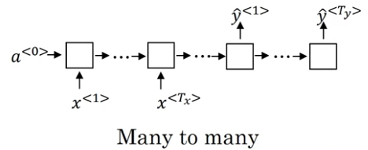

# Uses of Sequence Models
* Speech Recognition
* Music Generation
* Sentiment Classification
* DNA Sequence Analysis
* Machine Translation
* Video Activity Recognition
* Named Entity Recognition

# Notation
* x\<t\> -> input at time t
* y\<t\> -> output at time t
* Tx -> total timesteps in input
* Ty -> total timesteps in output
* X(i)\<t\> -> for i'th example, input at time t
* Y(i)\<t\> -> for i'th example, output at time t
* Tx(i) -> for i'th example, total timesteps in input
* Ty(i) -> for i'th example, total timesteps in output

## Representing Words
* Create a vocabulary, all the words indexed from 0 - (V-1).
* Use **one-hot representation** for words. (in a vector, 1 at the position of the word, rest are 0's)

# Recurrent Neural Network Models
## Using a standard NN
* Problems - 
  * Inputs and outputs can be of different lengths
  * Doesn't share features learned across different positions of text

## Recurrent Network - Forward

  | Timestep | Activation | Output |
  | :-: | :-: | :-: |
  | 0 | a<0> = 0 | - |
  | 1 | a<1> = `g(np.dot(Waa, a<0>) + np.dot(Wax, x<1>) + ba)` | y_hat<1> = `g(np.dot(Wya, a<1>) + by)` |
  | t | a\<t\> = `g(np.dot(Waa, a<t-1>) + np.dot(Wax, x<t>) + ba)` | y_hat\<t\> = `g(np.dot(Wya, a<t>) + by)` |

**Note**: 
* Waa -> weight between connection from hidden to hidden
* Wya -> weight between connection from hidden to output
* Wax -> weight between connection from input to hidden
* Activation for hidden layer -> usually tanh, sometimes relu
* Activation for output layer -> depends on task, sigmoid for binary calssification, softmax for multiclass

**Note - Simplified Notation**:
* [Waa | Wax] -> Wa (concatenate Waa and Wax) for simplified represenation
* Also, Wya = Wy
* So a\<t\> = `np.dot(Wa, [a<t-1>, x<t>] + ba)`, a\<t-1\> and x\<t\> also needs to be concatenated

## Recurrent Networks - Backward - BPTT

## Different Types of RNNs
| Type | Extra | Figure | Example |
| :-: | :-: | :-: | :-: |
| one-to-one | Basic Neural Network |  | Image Classification | 
| Many-to-one | Tx, Ty=1 |  | Sentiment Analysis |
| one-to-many | Tx=1, Ty |  | Music Generation |
| many-to-many | Tx=Ty |  | Named Entity Recognition |
| many-to-many | Tx != Ty |  | Machine translation |

# Language Model and Sequence Generation
## Language Model
* gives the probability of a sentence
* P(y<1>, y<2>, y<3>,.... y\<Ty\>)
* important component of Speech Recognition and Machine Translation

### Training
* Training set - large corpus of english text
* Process - 
  * Tokenize (create vocabulary)
  * Add \<EOS\> token -> end of sentence
  * Add \<UNK\> token -> unknown or out of vocabulary
  * One-hot encode all input sentences
  * Pass sentence from RNN, at timestep t,
    * Input - x\<t\>
    * Output - y\<t+1\>
  * This creates a model which predicts the next word given the previous words i.e P(y\<t+1\> | y<1>, y<2>, y<3>..., y\<t\>)
  * Loss - Softmax loss over all words in vocabulary

## Sampling Novel Sequences
* Training as -
  
  
* Sample as -
  * At first timestep, input a 0 vector (`x<1>=0`) which will give us a probability distribution over words as output(`y<1>`).
  * Sample from the (`y<1>`) softmax distribution (`x<2> = np.random.choice(.)`)
  * Input the sampled word (`x<2>`) at the next timestep
  * Repeat until \<EOS\> is observed or a fixed number of words
  

**Note**: Character-level language model can also be created by having a vocab of characters, and punctuations. PROS: No worry of UNK. CONS: Much longer sentences.

# Vanishing Gradients
* RNNs suffer from vanishing gradients - 
  * When we unroll the network, it acts as if a very deep network.
  * So backpropagation through all the unrolled steps can lead to very small gradients, and the gradients from the later timesteps might not affect the initial steps.
  * Problem of local dependency.
* RNNs usually doesnt suffer form exploding gradients - 
  * If they do, apply *Gradient Clipping*.

# Gated Recurrent Units (GRU) and Long Short Term Memory Units (LSTM)
* Modification of RNN to help in 
  * capturing long range dependencies
  * addressing problem of vanishing gradient

| | Basic RNN | Simple GRU | Full GRU | LSTM |  
| :-: | :-: | :-: | :-: | :-: |
| Cell |  | | Something |  |
| Equation | `a<t> = g(np.dot(Wa,[a<t-1>, x<t>]) + ba)` | `c<t> = a<t>`   `c_hat<t> = tanh(np.dot(Wc, [c<t-1>, x<t>]) + bc)`   `gamma_u = sigmoid(np.dot(Wu, [c<t-1>, x<t>]) + bu)`   `c<t> = gamma_u*c_hat<t> + (1-gamma_u)*c<t-1>` | `c<t> = a<t>`   `c_hat<t> = tanh(np.dot(Wc, [gamma_r*c<t-1>, x<t>]) + bc)`   `gamma_u = sigmoid(np.dot(Wu, [c<t-1>, x<t>]) + bu)`   `gamma_r = sigmoid(np.dot(Wr, [c<t-1>, x<t>]) + br)`   `c<t> = gamma_u*c_hat<t> + (1-gamma_u)*c<t-1>` | `c_hat<t> = tanh(np.dot(Wc, [a<t-1>, x<t>]) + bc)`   `gamma_u = sigmoid(np.dot(Wu, [a<t-1>, x<t>]) + bu)`   `gamma_f = sigmoid(np.dot(Wf, [a<t-1>, x<t>]) + bf)`   `gamma_o = sigmoid(np.dot(Wo, [a<t-1>, x<t>]) + bo)`   `c<t> = gamma_u*c_hat<t> + gamma_f*c<t-1>`   `a<t> = gamma_o*tanh(c<t>)` | 
| Memory | No Memory | The `gamma_u` maintains the cell state i.e. if something from the earlier timesteps is needed at the later timesteps, then `gamma_u` will be set accordingly such that c\<t\> contains the information from the previosu steps.| Same as simple GRU | Setting appropriate values to the update (`gamma_u`) and forget (`gamma_f`) gates can help the LSTM cell to control what information to pass on to the next time step.  |
| Vanishing Gradient | Suffers from Vanishing Gradient | The update gate maintains the value of c\<t\>, either through c\<t-1\> or through c_hat\<t\>, so doesnt encounter the vanishing gradient problem.| Same as Simple GRU | asd |

**Note**: 
* In GRUs, *gamma_u* and *gamma_r* are update and reset gates respectively, which which controls the amuount of information to pass or stop.
* In LSTMs, *gamma_u*, *gamma_f* and *gamma_o* are update, forget and output gates respectively, which controls the amount of information to pass or stop.
* In LSTMs, to calculate the values of the gates, we can also use c\<t-1\> (`gamma = sigmoid(np.dot(W, [a<t-1>, x<t>, c<t-1>]) + b)`) also, this is called *Peephole connection*.
* [ On the properties of Neural Machine Translation: Encoder-Decoder Approaches - Cho (GRU)](https://arxiv.org/pdf/1409.1259.pdf)
* [Emperical Evaluation of Gated Recurrent Neural Networks on Sequence Modeling - Chung (GRU)](https://arxiv.org/pdf/1412.3555.pdf)
* [Long Short Term Memory - Hochreiter (LSTM)](https://www.bioinf.jku.at/publications/older/2604.pdf)

# Bidirectional RNNs
* Contains 2 RNN *sublayers* in one layer.
  * one take input in the left-to-right direction
  * another takes input in the right-to-left direction
  * If the cell size is x, the output of a BRNN layer is of size 2x. The outputs from both the directions are concatenated.

# Deep RNNs

* Stack multiple layers of RNNs