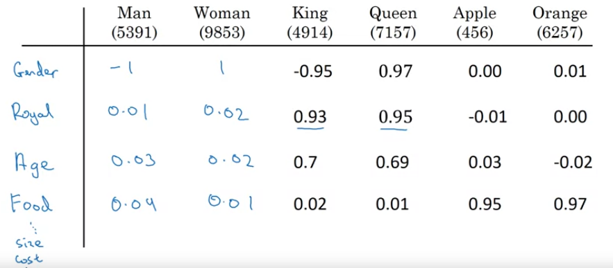
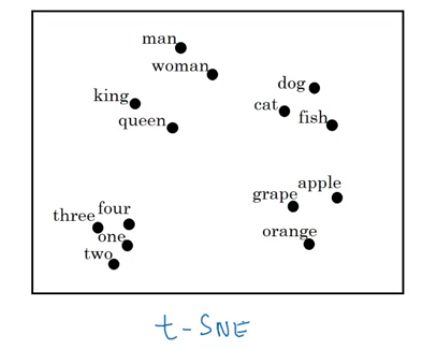
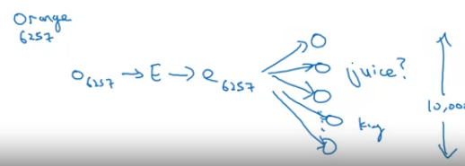
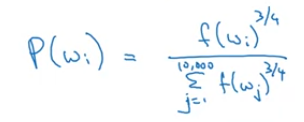
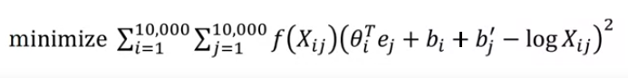
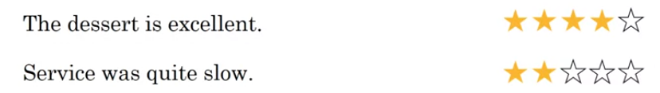
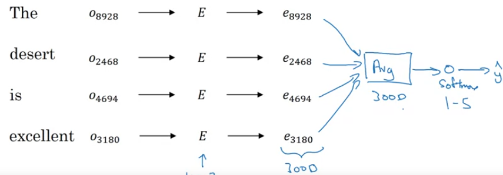
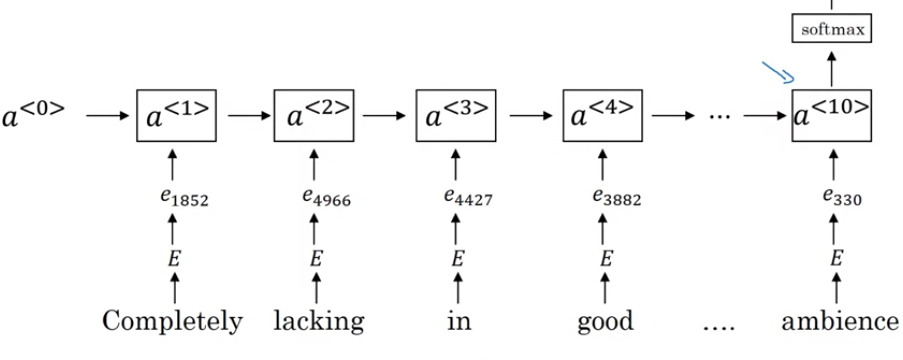

# Word Representation
## One Hot Representation
* Words can be represented using a vocabulary and one hot vector for each word.
* Drawbacks -
  * Every word in independent. Inner product between words is 0. So no similarity.
  * No generalization across words
  
**Note**: In the notes, one hot encoding of a particular word is represented as o_\<x\> x being the index of the word or the word itself in the vocab. Eg. o_5236 or o_orange
  
## Feature Representation - Word Embeddings
* Multiple features to represent a word
  
* Pros - 
  * Inner product between word representations is not 0. So similarity between words.
  * Visualizing word embeddings using tSNE shows similar words being plotted closer together.
  
  * [Visualizing Data using t-SNE - van der Maaten (TSNE)](http://www.jmlr.org/papers/volume9/vandermaaten08a/vandermaaten08a.pdf)
  
**Note**: In the notes, embedding of a particular word is represented as e_\<x\> x being the index of the word or the word iteslf in the vocab. Eg. e_5236 or e_orange

## Using word embeddings
* Instead of one-hot encoding, can use word embeddings for words
* Learn word embeddings from large text corpus or download pre-trained embeddings.
* Transfer embedding to new task with smaller data
* Finetune the word embeddings with new data(if data is somewhat larger - 10k words)

## Analogies using Word Embeddings
Word embeddings can carry out analogy questions
* Man:Woman -> Boy:?
* Ottawa:Canada -> Nairobi:?
* Big:Bigger -> Tall:?
* Yen:Japan -> Ruble:?
* Man:woman -> King:?
  * Find word: argmax{w} similarity(e_w, e_king - e_man + e_woman)
  * similarity -> cosine similarity

## Embedding Matrix
* Learning word embeddings mean learning Embedding matrix
* If |V| = 10000, dim = 300:
  * Embedding matrix **E** shape -> 300 x 10000
* Getting an embedding of a word - 
  * e_\<word\> = np.dot(E, o_\<word\>) where o_<word> is the one-hot encoding of a word.

**Note**: Intuitively its fine to understand the method of getting the word embedding using matrix multiplication but its very high dimensional, so not efficient. Its better to use a map instead.

# Learning Word Embeddings
## Neural Language Model
* Inputting words (context) and predicting next word (target)
* Algorithm
  | Step | Function | Shape |
  | :-: | :-: | :-: |
  | Take a window of n-words | - | `1 x n` |
  | one-hot encode each word | - | `X = |V| x n` |
  | Pass through randomly initialized Embedding matrix E |  `np.dot(E, X)` | E = `(300 x |V|)`   output = `300 x n` |
  | Concatenate all vectors | - | `300*n x 1` |
  | Predict the next word | - | `|V| x 1` |
  | Backprop and repeat | - | - | 
* Context can be - 
  * Left 4 words -> predict next word
  * Left 4 words and right 4 words -> predict middle word
  * Left one word -> predict next word
  * Nearby one word (Skipgram)
* [A Neural Probablistic Langiage Model - Bengio](http://www.jmlr.org/papers/volume3/bengio03a/bengio03a.pdf)

## Word2Vec - Skipgram
* Inputting words (context) and predicting next word (target)
  * Context - Random word
  * Target - Another random word in a fixed window around the context word
* Algorithm -
  * Select a context word and one-hot encode (o_c)
  * Select a target word and one-hot encode (y_t)
  * e_c = np.dot(E, o_c) -> E is the embedding matrix of size (|V| x 300)
  * Apply softmax. P(y_hat_t|c).
  * Cross Entropy Loss between y_t and y_hat_t
* Drawbacks - 
    * Computational Cost - Calculating softmax over a large vocabulary for every word is inefficient.
* Solutions - 
    * Hierarchical Softmax Classifier
    * Negative Sampling
* [Efficient Estimation of Word Representations in Vector Space - Mikolov (word2vec)](https://arxiv.org/pdf/1301.3781.pdf)

## Word2Vec - Continuous Bag of Words (CBOW)
* Inputting words (context) and predicting next word (target)
  * Context - A window of words to the left and right of a word
  * Target - middle word whose left and right windows are selected as context
* [Efficient Estimation of Word Representations in Vector Space - Mikolov (word2vec)](https://arxiv.org/pdf/1301.3781.pdf)

## Negative Sampling
* Make multiple context - target pairs (one true and others false)
* Train a binary classifier to predict whether a particular context - target pair is true or not.
* So the problem becomes whether a pair of word is true sample or negative sample
* Algorithm - 
  * Choose a context word c.
  * Choose a target word word from a nearby window of c. This pair is a true pair.
  * Choose *k* random words from the corpus and those words paired with c will form the false context-target pairs.
  
    | Context | Word | Target? | Type |
    | :-: | :-: | :-: | :-: |
    | orange | juice | 1 | True Sample |
    | orange | king | 0 | Negative Sample |
    | orange | book | 0 | Negative Sample |
    | orange | the | 0 | Negative Sample |
    | orange | of | 0 | Negative Sample |

  * For these k+1 pairs,
    * we get the context word embedding from *E* matrix.
    * Apply a sigmoid classifier with all the (k+1) target words. `( P(y=1 | c,t) = sigmoid(np.dot(theta_t, e_c)) )`
    * So we have in total |V| sigmoid classifiers, but during training, we train only k+1 sigmoid output nodes at a time.
    
  * So instead of one |V|-way softmax problem, we have |V| binary classifications out of which we train only k+1 of them at a time, which is computationally very efficient.
* [Distributed Representations of Words and Phrases and their Compositionality - Mikolov (Negative Sampling)](https://papers.nips.cc/paper/5021-distributed-representations-of-words-and-phrases-and-their-compositionality.pdf)
  
### How to sample negative samples
* Based on the emperical frequency of word occurance
  * this will lead to more occurance of the, of, and etc
* Uniform distributon 1/|V|
  * Non-representative of a language
* Paper uses -
  * P(w) = f(w)^(3/4)/sum_over_all_words(f(w)^(3/4))
  
  * f(w) -> frequency of a word
  * Somewhere in between uniform distribution and sampling based on relative occurence of words

## GloVe
* Select a window size
* Calculate co-occurence Xij -> number of times j occurs in the context(window size) of i.
* Minimize the squared cost objective -
  
  * f(Xij) - a weighing function
    * such that word pairs whose Xij = 0 dont create a problem while minimizing the objective
    * such that every word pair gets sufficient importance, eg. words like the, of, and should not get more weight, and words which are uncommon should not get very less weight.
  * Here, theta and e are symmetric, so after training, we can average them out to get the final embeddings
  
* [GloVe: Global Vectors for Word Representation - Pennington (Glove Embeddings)](https://nlp.stanford.edu/pubs/glove.pdf)

**Note**: The components of word embeddings cant be guaranteed to be humanly interpretable, like first dim of an embedding can't be guaranteed to represent with a feature like age or gender or anything else.

# Sentiment Classification
* Input - text; Output - a label, sentiment, star rating 
  

* Challenges - 
  * Requires a large labelled dataset
* Word Embeddings can help
  
## Simple Sentiment Classification Model
* Take embeddings for individual words
* Average them.
* Apply Softmax.
  
* *Problem* - Ignores word orders
  
## RNN for sentiment classification
* Take embeddings for individual words
* Pass them through RNN
* Apply softmax at the last step (many-to-one RNN architecture)
  
* This takes word order in account, so performs better.

# Debiasing Word Embeddings
* Generally, the word embeddings have biases - gender, ethnicity, orientation etc
* Examples -
  *  Man:Conputer_Programmer as Woman:Homemaker -> Gender Stereotype in the word embedding model
  *  Father:Doctor as Mother:Nurse
*  This bias in the embeddings comes from the text used to train the embeddings
  
## Addressing bias in word embeddings
* **Identify bias direction**
  * e_he - e_she
  * e_male - e_female etc
  * Average them out
  * This can give us the bias direction. Example here is gender
* **Neutralize** - for words which are non-definitional, project to get rid of the bias
  * definitional words - Words like grandmother, grandfather, girl, by definition contains gender compoment.
  * non-definitional words - Words like doctor, babysitter, should be neutralized in the bias direction
  * To find out which words are definitional, the authors train a classifier, deciding which words are gender specific and which words are non-gender specific
* **Equalize pairs** - Gender differentiating words like grandmother and grandfather, or boy and girl should be equidistant from gender neutral words like doctor, babysitter etc
* [Man is to Computer Programmer as Woman is to Homemaker? Debiasing Word Embeddings - Bolukbasi](https://arxiv.org/pdf/1607.06520.pdf)