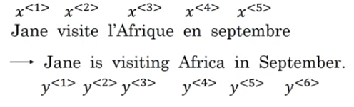
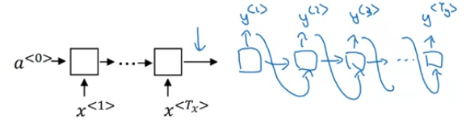
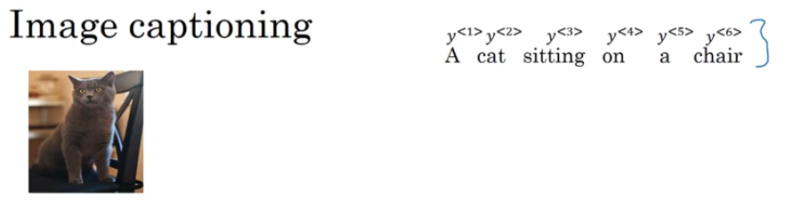

# Sequence to Sequence Models
* Input - A sequence
* Output - A sequence
* Can be of same or different lengths
* Two sub-modules - Encoder and Decoder
* *Encoder* - encodes the input in some form
* *Decoder* - takes the output of encoder an decodes it into result
  
## Machine Translation Example - French to English

* Takes an input a French Sentence
* Encodes it
* Decodes it to output English sentence
  
* [Sequence to sequence learning using Neural Networks - Sutskever](https://papers.nips.cc/paper/5346-sequence-to-sequence-learning-with-neural-networks.pdf)
* [Learning Phrase Representations using RNN Encoder-Decoder for Statistical Machine Learning - Cho](https://arxiv.org/pdf/1406.1078.pdf)
  
## Image Captioning Example

* Take an input image and encodes it.
* Decodes it to a caption in some language.
  
* [Deep Captioning using Multimodal Recurrent Neural Networks - Mao](https://arxiv.org/pdf/1412.6632.pdf)
* [Show and Tell: A Neural Image Caption Generator - Vinyals](https://arxiv.org/pdf/1411.4555.pdf)
* [Deep Visual-Semantic Alignments for Generating Image Descriptions - Karpathy](https://cs.stanford.edu/people/karpathy/cvpr2015.pdf)

# Picking the most likely sentence
* Language Model -> P(y<1>, y<2>, y<3>...,y\<Ty\>)
* Machine Translation -> P(y<1>, y<2>, y<3>...,y\<Ty\> | x<1>, x<2>,...., x\<Tx\>)
* Machine translation can be thought of as a **Conditioned Language Model** where the output sequence is conditioned on the input sequence from the first language.
* The difference between LM and MT is, we dont sample randomly as in LM, we need to find the output sequence which maximizes the P(y|x), i.e. the most likely sentence.
  
* This can be done using -
  * *Greedy Search* - At each output timestep, sample the word with the highest probability. 
  * Search the entire search space - Highly inefficient as it goes exponential
  * *Beam Search* - Approximate Search algorithm

## Beam Search
* To get the best/most likely output, and not random.
* Used in Machine Translation or Speech Recognition to get the best output
* Algorithm - **B** -> Beam width, **V** -> vocabulary size
  * Encode the input sequence using Encoder Network
  * Pass the encoded output to the decoder network
  * The first output of the decoder gives us P(y<1>|X)
    * Instead of selecting a single word with highest probability, We select top B words. Let B=3, so we select 3 words in the first step. Let the three words be a, b, c.
  * The second output of the decoder network gives us P(y<2>|X,y<1>).
    * We take another step of the decoder taking y<1> as a,b and c respectively. (Making **B**(3, in this example) copies of the network)
    * P(y<2>|X,y<1>=a)
    * P(y<2>|X,y<1>=b)
    * P(y<2>|X,y<1>=c)
    * This gives us the probability distribution of the second word, when the first word is a, when the first word is b and when the first word is c.
    * We calculate `P(y<1>,y<2>|X) = P(y<1>|X)*P(y<2>|X,y<1>)`
    * We get B*V number of probabilities for P(y<1>,y<2>|X). As B=3, we select the top 3 choices for the second word.
  
  * Repeat previous step for the next words (i.e. calculate P(y<1>,y<2>,y<3>|X), which will give us B*V probabilities, and select the top B choices)until we get \<EOS\> or a specified length
  
  
### Refine Beam Search

* *Problem 1*: Taking a product of probabilities P(y\<t\>|X,y<1>,...,y\<t-1\>) (mostly numbers less than 1), will make the product smaller and smaller.
  * Can lead to numerical underflow, too small to accurately represented by floating point representation
  * Apply log to the product, changes to sum of logs
    * argmax (over y) P(y|x) = argmax (over y) sum{log P(y|x)}
  
  * Also, log is monotonically increasing, so maximising the log of product is equal to maximising the product.
*  *Problem 2*: As we are multiplying numbers smaller than 1, and are trying to maximize the product, this will inherently favour multiplying lesser numbers.  
   *  So outputs of smaller lengths are favoured. Same goes for log sum, as log of less than 1 is negative.
   * Length Normalization - Normalize the probability product or log likelihood. Multiply by term (1/Ty).
  

**Note**:
* **Setting Beam Width** -

    | | Pros | Cons |
    | :-: | :-: | :-: |
    | *If B is large* | Checking a large number of options, so better results | More Computation, Slower |
    | *If B is small* | Less Computation, Faster | Checking smaller number of options, so quality of results degrade |

* Beam Search runs faster, but doesnt guarantee exact maximum, its an approximate algorithm.

### Error Analysis

* Lets assume there is an error in the translation.
* There are two components in the MT model - the RNN model and the Beam Search component.
* Analysis -
  * Compute P(y*|X) and P(y_hat|X) for utterances in the dev set
    | Observation | Inference | Reason |
    | :-: | :-: | :-: |
    | If P(y*\|X) > P(y_hat \|X) | Beam Search is at fault | As RNN has given more probability to y*, and it is the true translation, RNN is correct |
    | If P(y*\|X) <= P(y_hat\|X) | RNN model is at fault | As RNN is giving less probability to y*, though it is the true translation, RNN is incorrect |
  * Calculate the fraction of errors by RNN and Beam Search, and take decision.

# BLEU Score - Evaluating Machine Translation
* BLEU - Bilingual Evaluation Understudy
* Calculating n-gram modified precision for various n values.
  
  * Bigram Modified Precision (P2)

    | Bigram (P2) | Count | Count-clip |
    | :-: | :-: | :-: |
    | | Count of bigram in output | Max count of the bigram in any of the references |  
    | the cat | 2 | 1 |
    | cat the | 1 | 0 |
    | cat on | 1 | 1 | 
    | on the | 1 | 1 |
    | the mat | 1 | 1 |

  * P2 = (sum of all the bigram clipped counts)/(sum of all the bigram counts)
  * Similarly, Pn = (Sum of all the n-gram clipped counts)/(Sum of all the n-gram counts)
* Combining multiple n-gram BLEU values into 1 value
  
* [ BLEU - A method for Autimatic Evaluation of Machine Translation - Papineni](https://www.aclweb.org/anthology/P02-1040.pdf)

# Attention Model
* **Problem with long sequences** - The input of the decoder is the output of the last step of the encoder, in the assumption that the last step contains all the information necessary to create the decoded output. This assumption fails with long sequences. So the BLEU score for a standard Encoder-Decoder model falls for longer sentences.
* Intuition -
  * Instead of memorizing the whole sequence and decode, we apply focus on some specific part of the sequence.
  * This is called attention.
  * Instead of feeding the output of the final step output of the encoder to the decoder, we feed in all the outputs from every step of the encoder.
  * These outputs are multiplied with attention weights, which tells us how much focus we should put on each output.
  * These attention weights, multiplied with the respective outputs, and added, forms the context vector, which is fed into the decoder.
  * Attention weights and context vector are calculated at every timestep of the decoder.
* [Neural Machine Translation by Jointly Learning to Align and Translate - Bahdanau (Attention)](https://arxiv.org/pdf/1409.0473.pdf)

## Implementation
* We need to calculate the attention weight for each of the encoder activations

* The weight for activation of encoder at time t depends on the decoder activation at time t-1 and the encoder activation at time t.

* This can be implemented using a small Neural Network which takes in as input the decoder activation at t-1, and encoder activations, and applies softmax.

* These weights are then multiplied with their corrsponding encoder activations, and added to form the context for decoder timestep t.

**Note**: 
* Attention can also be applied to other fields also like image captioning.
* [ Show, Attend and Tell: Neural Image Caption Generation with Visual Attention - Xu ](https://arxiv.org/pdf/1502.03044.pdf)
* Can also visualize attention.
  

# Speech Recognition
* Input - Audio clip
* Output - Text Transcript
* Preproccesing of Audio clip - Generate Spectrogram - Plot of frequency vs time and intensity of color shows energy.

## Attention Model

  * Input - Audio time frames
  * Output - Words or characters

## CTC - Connectionist Temporal Classification

* Large number of audio frames, and output words are usually very less, so outputting at every steps gives more number of output than required
* Example 
  * text - "the quick brown fox"
  * output - ttt-h-eee---\<space\>---qqq---
  * CTC algo - collapse repeated characters not separated by blank (-)
* [Connectionist Temporal Classification: Labelling Unsegmented Sequence Data with Recurrent Neural Networks - Graves (CTC)](https://www.cs.toronto.edu/~graves/icml_2006.pdf)

# Trigger Word Detection

