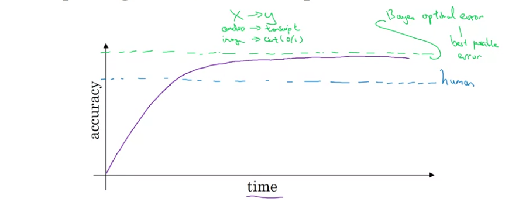
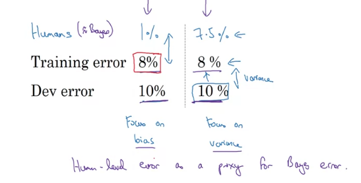
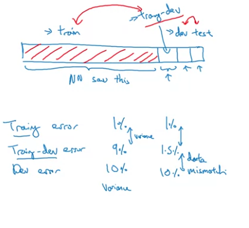
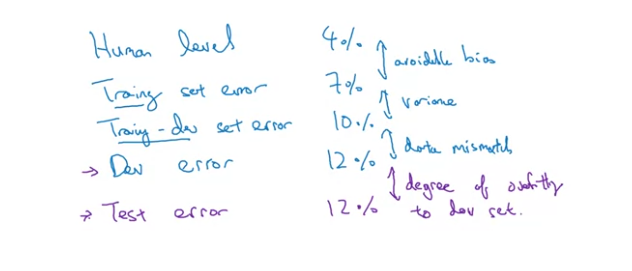
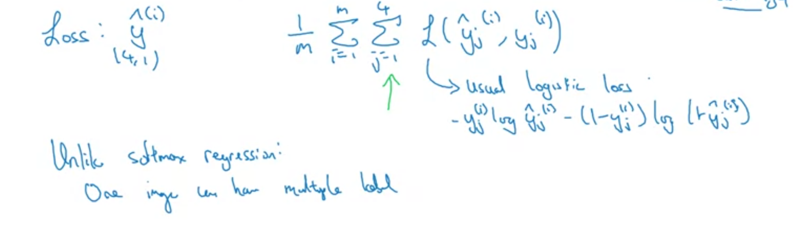

# Week 1
## Orthogonalization
* Orthogonal means 90 degress of each other
* Separation of concerns - separate solutions for separate problems
* Assumptions in ML:
  * Fits training set well on cost function
    * Bigger network
    * Better optimization algo
  * Fits dev set well on cost function
    * Regularization
  * Fits test set well on cost funtion
    * Bigger dev set
  * Performs well in real world
    * Change dev set or cost function 

**Note**: Don't use early stopping, as it effects both performance on training set and performance on dev set.

## Single number evaluation metric
* Suppose have a classifier, we use Precision and Recall as 2 measures. 
* If we have two models, it hard selecting the better out of them as there are two evaluation metrics.
* Better to use F1 score, as it combines both Precision and Recall, as a single number evaluation metric.

### Satisficing and Optimizing metrics
* Supoose you have multiple metrics, which can't be linearly combined.
* You can choose them as satisficing and optimizing metrics.
* Eg. A classifier, two metrics, accuracy and running time.
  * As accuracy is what we will try to maximize, it will be the optimizing metric -> as you want this as better as bpossible.
  * subject to running time to be less than some value, so running time will be our satisficing metric -> as it will work to be less than some threshold
 * Eg. wake up devices, two metrics, accuracy and # false positives per 24 hrs.
   * Accuracy can be optimizing metric
   * \# false positives less than 4 per day will be the satisficing metric

 **Note**: N metrics, so 1 metric as optimizing, and N-1 as satisficing metrics.

## Train/Dev/Test Distributions
* Train on train set, evaluate on dev set to make it better and better. Final performance on test set.
* Choose the dev set and the test set to reflect the data you expect to get in future.
* Dev and Test set should be from the same distribution.

### Size of the dev/test sets
* Old way of splitting data -> 70/30 or 60/20/20 (when dataset were smaller)
* This split no longer applies as dataset sizes are very large.
* Size of the test set to be big enough to give high confidence in the performance

### When to change dev/test sets and metrics
* When the evaluation metric doesnt correctly rank the algorithms we try, then change the metric or dev set. 

## Comparing to human-level performance
* Deep learning has made the performance of lots of algorithms better, so its feasible to compare them with human level performance.
* Comparing with human level performance can help to increase the performance of the ML algo.
  * Get more labeled data from humans
  * Bias-Variance analysis depends on human level performance
* Bayes optimal error is the error which cant be passed.

* Human level performance is really close to Bayes optimal error.

## Avoidable Bias
* We want out algorithm to learn teh training set well but not too well.

* Bias Variance analysis depends on human level performance.

* **Avoidable Bias** - Difference between the (human level performance)/(bayes error) and the training set error of the algorithm.
  * If this is high, there is room for reducing this.
* Diff between the training error and the dev set error is the variance.

## Understanding Human level performance
* using human level error as a proxy for bayes error
* Choose human level performance estimate carefully.
* It is harder to improve when you are closer to human level error
* Bias variance analysis is done keeping in mind the bayes error.

### Surpassing human level performance
* Egs where ML surpasses human level performance - 
  * Online advertising
  * Product Recommendations
  * Logistics
  * Loan approvals
* This is learning from structured data, not natural perception problems like speech recognition, or computer vision

## Improving your model performance
### Two fundamental assumptions
* Fit on training data really well (Less Avoidable bias). If more avoidable bias:
    * Train bigger model
    * Train longer
    * Better optimization algos
    * Better NN architecture/Hyperparameter search
* Training set performance generalizes well on dev set (Variance is not too bad). If variance is large: 
  * Regularization -> L2, dropout, data augmentation
  * NN architecture/hyperparameter search

# Week 2
## Error Analysis
* When trying to fix a problem , analyse how much will that improve the performance of the system.
* * Evaluate several ideas in parallel - Calculate % of errors being contributed by the individual problems (by checking a set of mislabelled examples). That can decide which problem to focus on.

## Cleaning up incorrectly labelled data
* Incorrect label in Training set - DL algorithms are robust to random errors in training set if the error is random and very low %age. -> Not robust to systematic errors
* Incorrect label in Dev/test set - Check the % of incorrect labels while analysing problems and if it is a relatively large number as compared to other problems, fix the labels.
* Notes for corrting labels:
  * Apply same process of label correction to both dev and test set

## Build your first system quickly and iterate
* Set up a dev/test set and metric
* Build initial system quickly
* Bias-Variance and Error analysis to priorize problems

## Mismatched training and dev/test data
* Dev/test should contain data depicting your problem
* Can use multiple datasets in training

## Error analysis with mismatched data distributions
* If train set and dev set errors have a huge gap, it can be due to 2 reasons - *different distributions of training and dev sets* or *the variance problem*
  * Can create a **training-dev** set, a subset of the training set which have the same distribution as training set but is not used in training
  

### Error Analysis

**Note**: The training-dev set error can be more than the dev and test set errors if the dev/test sets are easier.

### Addressing Data Mismatch
* Understand differences between train and dev sets - like traing set is clean while dev set is noisy
* Make training data more similar to dev/test set
* Artificial data synthesis - Reverberation or Noise augmentation to clean audio

## Transfer Learning
* Apply knowledge from one task and apply to other task. Adapt/transfer.
* Eg. (pretraining) train model on image recognition, remove output layer, add new output layers for another task (radiology diagnosis) and train again using radiology data (finetuning)
* Transfer learning from A to B makes sense when -
  * Input from A and B are same
  * data for task A is much more than task B
  * Low level features for both task A and task B are similar

## Multitask Learning
* In MTL, one NN is trained simultaneously on multiple tasks
*  Single input, multiple outputs, one for each task.
* MTL loss - 
  
  **Note**: 4 is the number of tasks here.
* Initial layers can share the initial layer features.
* MTL makes sense when -
  * when multiple tasls can share lower level features
  * amount of data for each task is similar - usually

## End-to-End Deep Learning
* Replace multiple stages of a problem with a single Deep Network
* Eg. Speech Recognition -> Going from features(MFCC), to phones, to words, to sentences -> to a single network
* Needs a whole lot more data

### When to use E2E or not
* Pros -
  * Let the data speak - rather than humans feeding specific features
  * Less hand desigining components
* Cons - 
  * Requires lots of data
  * Hand designed components are excluded - they are created using human expertise

